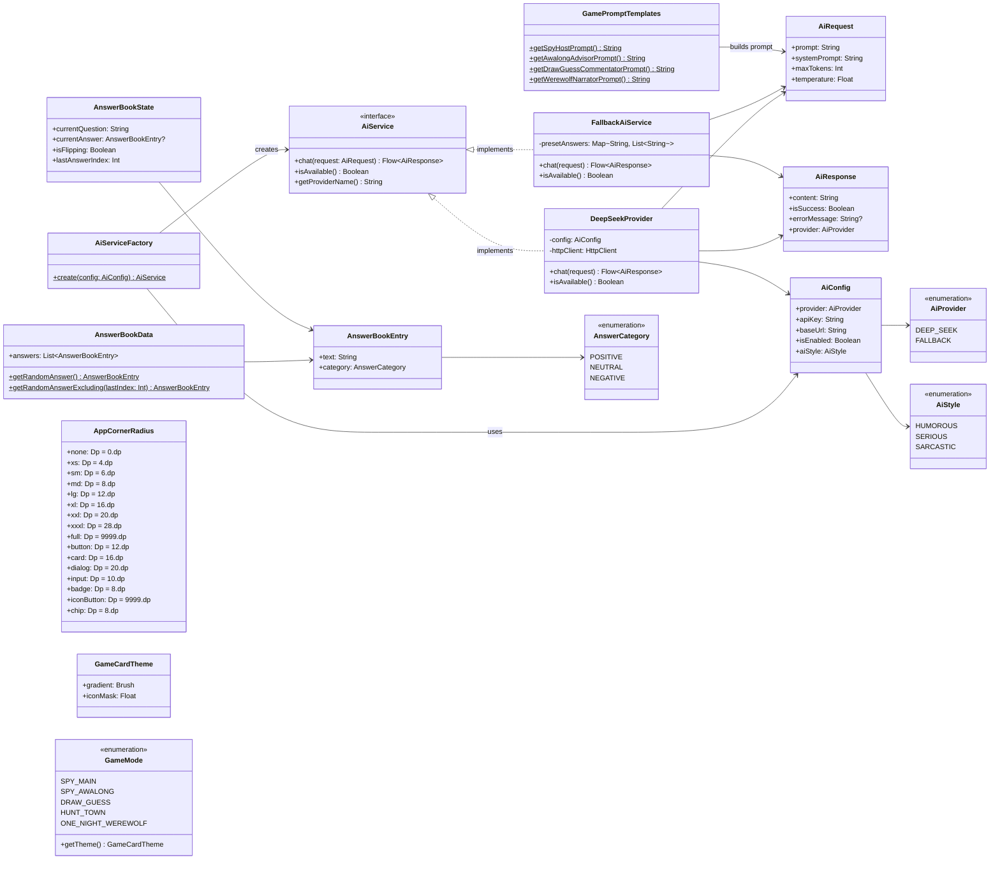
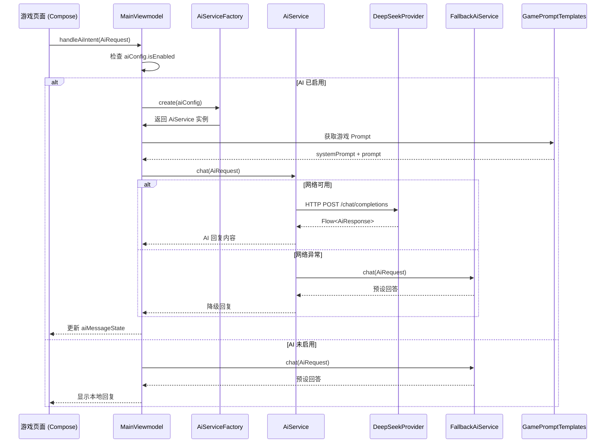
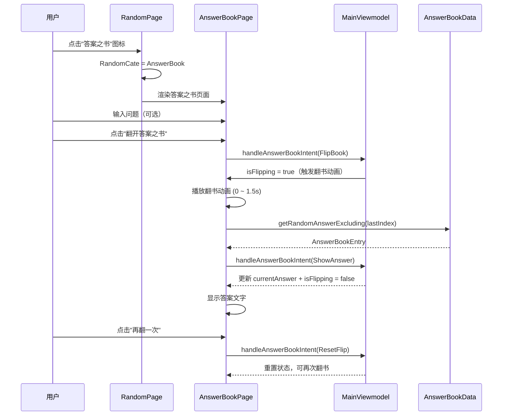
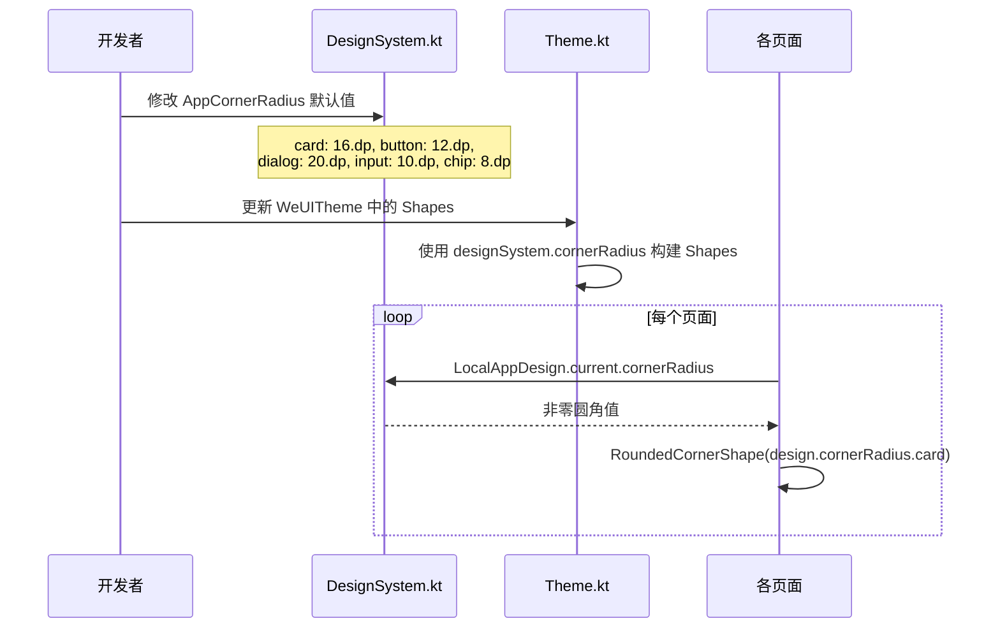
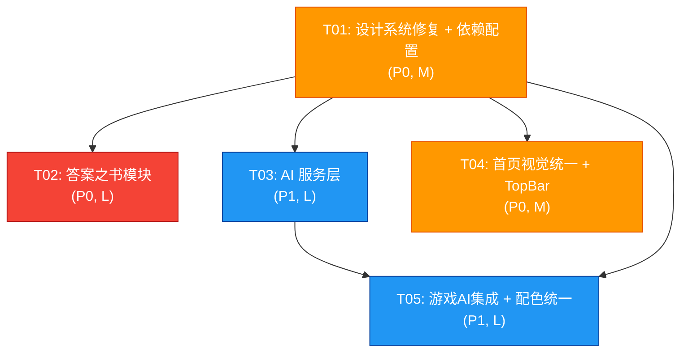

# YiGameCopilotX V2 — 系统架构设计文档

> 基于 PRD-V2，基于现有 129 个 Kotlin 文件的实际代码结构进行设计。

---

## Part A: 系统设计

### 1. 实现方案 + 框架选型

#### 1.1 现有架构分析

| 维度        | 现状                                                                                                                |
|-----------|-------------------------------------------------------------------------------------------------------------------|
| **架构模式**  | 类 MVI（Intent → ViewModel → StateFlow → UI），但未严格分层。单个 `MainViewmodel` 承载所有业务（~1300行）                               |
| **状态管理**  | `StateFlow` + `SharedFlow`，组件通过 `.collectAsState()` 订阅                                                            |
| **导航**    | Jetpack Navigation Compose，`NaviRoute` 枚举定义路由                                                                     |
| **设计系统**  | `AppDesignSystem`（`LocalAppDesign`）已定义完整的颜色/间距/圆角/阴影/字体体系，但 **`AppCornerRadius` 全部为 0.dp**，`NoRoundShapes` 也全部为 0 |
| **持久化**   | MMKV（键值对），无数据库                                                                                                    |
| **网络**    | WebSocket（房间模块），KMP expect/actual 模式                                                                              |
| **数据序列化** | `kotlinx.serialization`                                                                                           |

#### 1.2 核心技术挑战

| 挑战                | 说明                                                       | 方案                                                                                     |
|-------------------|----------------------------------------------------------|----------------------------------------------------------------------------------------|
| **KMP 网络层**       | AI 接口需要 HTTP Client，需在 commonMain/Android/iOS/WasmJs 均可用 | 使用 **Ktor Client**（项目已有 `libs.ktor.client.darwin` iOS 依赖），在 commonMain 声明，各平台提供 Engine |
| **AI 服务抽象**       | 需支持多 Provider 且可降级                                       | 定义 `AiService` 接口 + `AiProvider` 枚举 + `FallbackAiService` 本地降级                         |
| **设计系统修复**        | 全局圆角为 0、硬编码颜色散布各处                                        | 修改 `AppCornerRadius` 默认值，通过 `shape()` 扩展函数统一使用                                         |
| **GameCard 视觉区分** | 当前 5 卡片均为金黄色渐变                                           | 在 `GameCardMeta` 中为每个游戏定义独立渐变色（与 GameMode 关联）                                          |
| **答案之书集成**        | 需作为随机工具的特殊类别，唯一实例                                        | 新增 `RandomCate.AnswerBook` 枚举值，使用 `RANDOM_PAGE_CONFIG_CATE_ANSWER_BOOK` 前缀             |

#### 1.3 框架选型

| 库                              | 版本  | 用途                | KMP 兼容          |
|--------------------------------|-----|-------------------|-----------------|
| **Ktor Client**                | 3.x | HTTP 网络请求（AI API） | ✅ commonMain    |
| **kotlinx.serialization**      | 已有  | JSON 序列化          | ✅               |
| **Jetpack Navigation Compose** | 已有  | 页面路由              | ✅               |
| **Material3 Compose**          | 已有  | UI 组件             | ✅               |
| **MMKV**                       | 已有  | 本地键值存储            | ✅ (Android/iOS) |

> **不引入**新状态管理库（如 Decompose），继续使用现有 ViewModel + StateFlow 模式。

#### 1.4 架构模式

延续现有 MVI 模式，但将 AI 相关逻辑封装为独立 Service 层：

```
UI (Compose) 
  → Intent (sealed class)
    → ViewModel (状态管理 + 协调)
      → AiService (接口) 
        → DeepSeekProvider (实现) / FallbackProvider (降级)
```

---

### 2. 文件列表及相对路径

> 所有路径相对于 `composeApp/src/commonMain/kotlin/org/walks/gamecopilot/`，`shared/` 路径相对于项目根目录。

#### 2.1 需要新建的文件

| #  | 文件路径                                        | 说明                      |
|----|---------------------------------------------|-------------------------|
| 1  | `service/ai/AiService.kt`                   | AI 服务接口定义               |
| 2  | `service/ai/AiProvider.kt`                  | AI Provider 枚举 + 配置     |
| 3  | `service/ai/AiConfig.kt`                    | AI 配置数据类                |
| 4  | `service/ai/DeepSeekProvider.kt`            | DeepSeek API 实现         |
| 5  | `service/ai/FallbackAiService.kt`           | 本地降级 AI（预设回答）           |
| 6  | `service/ai/AiServiceFactory.kt`            | AI 服务工厂                 |
| 7  | `service/ai/prompts/GamePromptTemplates.kt` | 各游戏 AI Prompt 模板        |
| 8  | `data/AnswerBookData.kt`                    | 答案之书 100+ 条数据集          |
| 9  | `data/entity/AnswerBookState.kt`            | 答案之书状态数据类               |
| 10 | `ui/page/random/AnswerBookPage.kt`          | 答案之书页面（翻书动画 + 交互）       |
| 11 | `ui/page/random/AnswerBookComponents.kt`    | 答案之书专用 UI 组件（书本视觉、翻页动画） |
| 12 | `intent/AiIntent.kt`                        | AI 相关 Intent 定义         |
| 13 | `intent/AnswerBookIntent.kt`                | 答案之书 Intent 定义          |

#### 2.2 需要修改的现有文件

| #  | 文件路径                             | 修改要点                                                                                         |
|----|----------------------------------|----------------------------------------------------------------------------------------------|
| 1  | `theme/DesignSystem.kt`          | 修复 `AppCornerRadius` 默认值为非零值（card:16, button:12, dialog:20, input:10 等）                      |
| 2  | `theme/Shape.kt`                 | 移除 `NoRoundShapes`，使用 DesignSystem 驱动的 Shapes                                                |
| 3  | `theme/Theme.kt`                 | 更新 `WeUITheme` 中的 `Shapes` 使用 `DesignSystem.cornerRadius`                                    |
| 4  | `ui/components/CommonTopBar.kt`  | 已完善，微调圆角使用 DesignSystem                                                                      |
| 5  | `ui/page/home/HomePage.kt`       | 修改 `GameCardMeta` 的 `brush` 为游戏独立主题色；修复 `RectangleShape` 为 `design.cornerRadius.cardShape()` |
| 6  | `ui/page/random/RandomPage.kt`   | 新增 `RandomCate.AnswerBook` 分支渲染                                                              |
| 7  | `ui/page/random/AddNewRandom.kt` | 在 `RandomCate` 枚举中添加 `AnswerBook`；过滤答案之书不被编辑/删除                                              |
| 8  | `ui/page/setting/SettingPage.kt` | 新增"AI 助手"设置卡片（Provider 选择、API Key、开关）                                                        |
| 9  | `navigation/NaviRoute.kt`        | 无需新增路由（答案之书在随机工具内渲染，不是独立路由）                                                                  |
| 10 | `MainViewmodel.kt`               | 添加 AI 状态管理、答案之书状态管理、新增 Intent 处理                                                             |
| 11 | `App.kt`                         | 微调二级页面 TopBar 使用 `CommonTopBar`                                                              |
| 12 | `data/entity/GameMode.kt`        | 添加 `themeGradient` 属性关联主题色                                                                   |
| 13 | `shared/.../Constants.kt`        | 添加 `RANDOM_PAGE_CONFIG_CATE_ANSWER_BOOK` 常量                                                  |
| 14 | `composeApp/build.gradle.kts`    | 添加 Ktor Client commonMain 依赖                                                                 |

#### 2.3 各游戏模块 AI 集成修改（P1 范围）

| 游戏模块 | 文件                                          | 修改要点                   |
|------|---------------------------------------------|------------------------|
| 谁是卧底 | `ui/page/game/localspy/LocalSpyGamePage.kt` | 发言阶段嵌入 AI 气泡、投票后 AI 裁决 |
| 阿瓦隆  | `awalong/AwalongGamePageOptimized.kt`       | 组队/任务阶段 AI 顾问提示        |
| 你画我猜 | `ui/page/drawguess/DrawBoardPage.kt`        | 绘画结束后 AI 点评            |
| 一夜狼人 | `werewolf/WerewolfGamePage.kt`              | 夜晚/白天阶段 AI 流程旁白        |

---

### 3. 数据结构和接口（类图）



---

### 4. 程序调用流程（时序图）

#### 4.1 AI 调用流程



#### 4.2 答案之书交互流程



#### 4.3 设计系统修复流程



---

### 5. 任务列表

> **按实现顺序排列**，每个任务包含：任务ID、描述、涉及文件、依赖关系、工作量估算。

#### T01: 项目基础设施 — 设计系统修复 + 依赖配置

- **优先级**: P0
- **工作量**: M（约 3-4 小时）
- **描述**:
    1. 修复 `AppCornerRadius` 所有默认值为 PRD 指定的非零值
    2. 更新 `Theme.kt` 中 `NoRoundShapes` 为使用 DesignSystem 的 Shapes
    3. 更新 `build.gradle.kts` 添加 Ktor Client commonMain 依赖
    4. 在 `Constants.kt` 添加 `RANDOM_PAGE_CONFIG_CATE_ANSWER_BOOK` 常量
    5. 为 `GameMode` 枚举添加主题色渐变属性
- **涉及文件**:
    - `theme/DesignSystem.kt`（修改）
    - `theme/Shape.kt`（修改）
    - `theme/Theme.kt`（修改）
    - `composeApp/build.gradle.kts`（修改）
    - `shared/.../Constants.kt`（修改）
    - `data/entity/GameMode.kt`（修改）
- **依赖**: 无

#### T02: 答案之书模块（数据 + 页面 + 集成）

- **优先级**: P0
- **工作量**: L（约 5-6 小时）
- **描述**:
    1. 创建 `AnswerBookData.kt`：100+ 条中文答案数据集（正面/中性/负面各 1/3）
    2. 创建 `AnswerBookState.kt`：答案之书状态数据类
    3. 创建 `AnswerBookIntent.kt`：答案之书 MVI Intent
    4. 创建 `AnswerBookPage.kt`：答案之书主页面（问题输入 + 翻书动画 + 答案显示）
    5. 创建 `AnswerBookComponents.kt`：翻书动画组件、书本视觉组件
    6. 修改 `RandomCate` 枚举添加 `AnswerBook` 类别
    7. 修改 `RandomPage.kt` 集成答案之书渲染分支
    8. 修改 `MainViewmodel.kt` 添加答案之书状态管理和 Intent 处理
    9. 确保答案之书为唯一实例、不可增删
- **涉及文件**:
    - `data/AnswerBookData.kt`（新建）
    - `data/entity/AnswerBookState.kt`（新建）
    - `intent/AnswerBookIntent.kt`（新建）
    - `ui/page/random/AnswerBookPage.kt`（新建）
    - `ui/page/random/AnswerBookComponents.kt`（新建）
    - `ui/page/random/AddNewRandom.kt`（修改：添加 RandomCate.AnswerBook）
    - `ui/page/random/RandomPage.kt`（修改：AnswerBook 分支）
    - `MainViewmodel.kt`（修改：答案之书状态 + Intent）
- **依赖**: T01

#### T03: AI 服务层（接口 + Provider + 工厂 + 降级）

- **优先级**: P1
- **工作量**: L（约 5-6 小时）
- **描述**:
    1. 创建 `AiService.kt` 接口：`chat(request) -> Flow<AiResponse>`
    2. 创建 `AiProvider.kt` 枚举和 `AiConfig.kt` 数据类
    3. 创建 `DeepSeekProvider.kt`：基于 Ktor Client 的 DeepSeek API 实现
    4. 创建 `FallbackAiService.kt`：本地预设回答降级方案
    5. 创建 `AiServiceFactory.kt`：根据配置创建 AI 服务实例
    6. 创建 `GamePromptTemplates.kt`：各游戏 AI Prompt 模板
    7. 创建 `AiIntent.kt`：AI 相关 MVI Intent
    8. 修改 `MainViewmodel.kt`：添加 AI 状态管理 + 意图处理
    9. 修改 `SettingPage.kt`：新增 AI 助手设置卡片
- **涉及文件**:
    - `service/ai/AiService.kt`（新建）
    - `service/ai/AiProvider.kt`（新建）
    - `service/ai/AiConfig.kt`（新建）
    - `service/ai/DeepSeekProvider.kt`（新建）
    - `service/ai/FallbackAiService.kt`（新建）
    - `service/ai/AiServiceFactory.kt`（新建）
    - `service/ai/prompts/GamePromptTemplates.kt`（新建）
    - `intent/AiIntent.kt`（新建）
    - `MainViewmodel.kt`（修改）
    - `ui/page/setting/SettingPage.kt`（修改）
- **依赖**: T01

#### T04: 首页视觉统一 + GameCard 五色方案 + TopBar 推广

- **优先级**: P0
- **工作量**: M（约 3-4 小时）
- **描述**:
    1. 修改 `HomePage.kt` 中 `GameCardMeta` 的 brush 为游戏独立主题色：
        - 卧底(紫)、阿瓦隆(蓝)、你画我猜(橙)、猎巫镇(深红)、一夜狼人(墨绿)
    2. 修复 `GameCard` 组件中所有 `RectangleShape` → `RoundedCornerShape(design.cornerRadius.card)`
    3. 修复硬编码颜色 → 使用 `MaterialTheme.colorScheme`
    4. 修复 `Surface` 组件中 `shape = RectangleShape` → 使用 DesignSystem
    5. 推广 `CommonTopBar` 到所有尚未使用的二级页面
    6. 统一 `App.kt` 中 `AppTopBar` 使用 `CommonTopBar`
- **涉及文件**:
    - `ui/page/home/HomePage.kt`（修改）
    - `App.kt`（修改）
    - 各二级页面文件（修改：TopBar 统一）
- **依赖**: T01

#### T05: 各游戏模块 AI 集成 + 全局配色统一

- **优先级**: P1
- **工作量**: L（约 6-8 小时）
- **描述**:
    1. 在谁是卧底游戏页嵌入 AI 主持人（发言引导 + 投票裁决）
    2. 在阿瓦隆游戏页嵌入 AI 顾问（组队建议 + 任务点评）
    3. 在你画我猜游戏页嵌入 AI 评论员（画作品评）
    4. 在一夜狼人游戏页嵌入 AI 旁白（流程播报）
    5. 消除所有页面中剩余的硬编码颜色
    6. 统一所有页面的间距为 `LocalAppDesign.current.spacing`
- **涉及文件**:
    - 各游戏模块页面文件（修改）
    - 各游戏模块组件文件（修改）
- **依赖**: T01, T03

---

### 6. 依赖包列表

> 所有新增依赖均需 KMP 兼容（commonMain 可用）。

```
# build.gradle.kts (commonMain.dependencies)

# Ktor Client — AI HTTP 请求
implementation("io.ktor:ktor-client-core:3.1.1")
implementation("io.ktor:ktor-client-content-negotiation:3.1.1")
implementation("io.ktor:ktor-serialization-kotlinx-json:3.1.1")

# 平台特定 Engine（已有部分）
# androidMain:
implementation("io.ktor:ktor-client-okhttp:3.1.1")
# iosMain: 已有 libs.ktor.client.darwin
# wasmJsMain:
implementation("io.ktor:ktor-client-js:3.1.1")
```

> **注意**：项目已有 `kotlinx.serialization`，无需额外添加。

---

### 7. 共享知识（跨文件约定）

#### 7.1 命名规范

| 规则                         | 示例                                                     |
|----------------------------|--------------------------------------------------------|
| Intent 类以 `Intent` 后缀      | `AiIntent`, `AnswerBookIntent`                         |
| State 类以 `State` 后缀        | `AnswerBookState`, `AiConfig`                          |
| Service 接口以 `Service` 后缀   | `AiService`                                            |
| Provider 实现以 `Provider` 后缀 | `DeepSeekProvider`                                     |
| 页面组件以 `Page` 后缀            | `AnswerBookPage`                                       |
| 随机工具类别前缀 `cate:`           | `RANDOM_PAGE_CONFIG_CATE_ANSWER_BOOK = "answer_book:"` |
| 常量全大写下划线                   | `RANDOM_PAGE_CONFIG_CATE_ANSWER_BOOK`                  |

#### 7.2 代码组织约定

- **AI 服务层**统一放在 `service/ai/` 目录下
- **AI Prompt 模板**统一放在 `service/ai/prompts/` 目录下
- **答案之书数据**放在 `data/` 目录下
- **新增 Intent** 放在 `intent/` 目录下
- **圆角统一**：所有组件使用 `LocalAppDesign.current.cornerRadius.xxx` 获取圆角值
- **配色统一**：所有页面使用 `MaterialTheme.colorScheme` 获取颜色，禁止硬编码 `Color(0xFF...)`

#### 7.3 AI 集成的统一模式

```
1. 游戏页面通过 ViewModel 发送 AiIntent
2. ViewModel 调用 AiService.chat() 获取 Flow<AiResponse>
3. ViewModel 将响应更新到 StateFlow
4. UI 通过 collectAsState() 自动刷新
5. 异常时 FallbackAiService 提供本地预设回答
```

#### 7.4 答案之书唯一性约束

- `RANDOM_PAGE_CONFIG_CATE_ANSWER_BOOK` 为系统保留前缀
- 答案之书在 `RandomCate` 中为独立枚举值
- 在 `RandomConfigList` 中标记为 `isSystemDefault`，禁止删除和编辑
- 数据为内置常量列表，不存储到 MMKV

#### 7.5 GameCard 主题色方案

```kotlin
// 卧底 — 紫色系
Brush.linearGradient(listOf(Color(0xFF9B7FED), Color(0xFF7C4DFF)))
// 阿瓦隆 — 蓝色系
Brush.linearGradient(listOf(Color(0xFF64B5F6), Color(0xFF2979FF)))
// 你画我猜 — 橙色系
Brush.linearGradient(listOf(Color(0xFFFFB74D), Color(0xFFFF9100)))
// 猎巫镇 — 深红系
Brush.linearGradient(listOf(Color(0xFFE57373), Color(0xFFC62828)))
// 一夜狼人 — 墨绿系
Brush.linearGradient(listOf(Color(0xFF81C784), Color(0xFF2E7D32)))
```

---

### 8. 待明确事项

| # | 问题                                                    | 建议                                                    | 影响                              |
|---|-------------------------------------------------------|-------------------------------------------------------|---------------------------------|
| 1 | **DeepSeek API 具体端点**：使用 `/v1/chat/completions` 还是其他？ | 建议使用 OpenAI 兼容格式 `/v1/chat/completions`，DeepSeek 默认支持 | `DeepSeekProvider.kt`           |
| 2 | **API Key 存储方式**：明文存储到 MMKV 是否足够安全？                   | V2 建议先用 MMKV，后续可考虑加密存储                                | `SettingPage.kt`, `AiConfig.kt` |
| 3 | **AI 响应超时时间**：游戏场景中 AI 回复需要多久返回？                      | 建议设置 10s 超时，超时后自动降级                                   | `DeepSeekProvider.kt`           |
| 4 | **答案之书翻书动画复杂度**：P0 仅需基础翻转动画，P2 升级 3D 效果？              | V2 P0 先实现基础 Y 轴翻转动画（复用现有 `FlippableCard` 模式）          | `AnswerBookComponents.kt`       |
| 5 | **猎巫镇 AI 功能是否纳入 V2**：PRD 中为 P2                        | 建议不纳入 V2，仅预留 Prompt 模板接口                              | `GamePromptTemplates.kt`        |
| 6 | **Ktor 版本兼容性**：需确认 Ktor 3.x 与现有项目 Kotlin 版本兼容         | 需检查 `libs.versions.toml` 中的 Kotlin 版本                 | `build.gradle.kts`              |
| 7 | **深色模式下 GameCard 主题色**：PRD Q6 建议独立调整                  | 建议为深色模式定义独立渐变方案，确保对比度                                 | `HomePage.kt`                   |

---

### 9. 任务依赖图



**并行性说明**：

- T02 和 T03 可以在 T01 完成后**并行开发**
- T04 可以与 T02/T03 **并行开发**
- T05 依赖 T01 + T03 完成，建议最后执行

---

### 10. 独立图表文件

以下图表已单独保存：

- 类图：`docs/class-diagram.mermaid`
- AI 调用时序图 + 答案之书时序图：`docs/sequence-diagram.mermaid`
