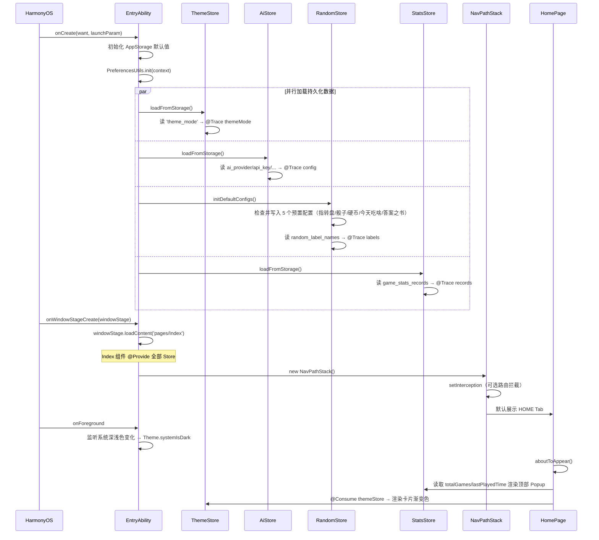
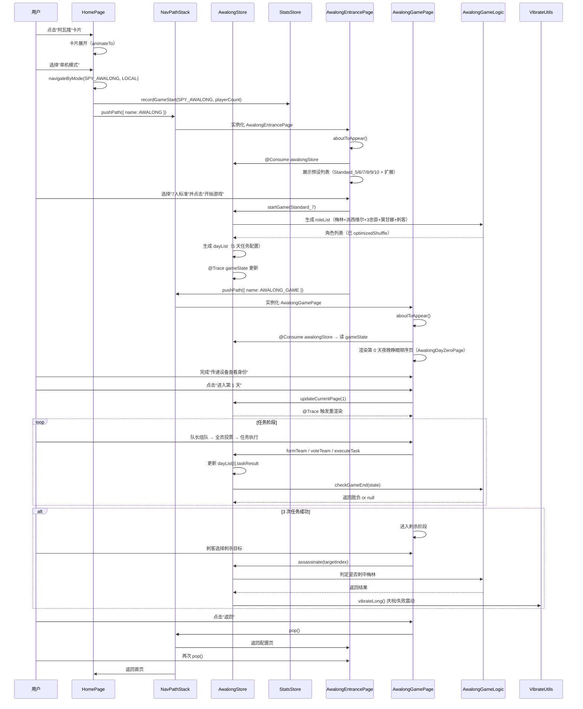

# YiGameCopilotX 鸿蒙 HarmonyOS 迁移 · 架构设计

> 架构师：高见远（Gao） | 日期：2026-07-12  
> 基于对原项目源代码实际阅读编写。所有目录、模型、字段均来自代码事实。  
> 前置文档：`01-PRD.md`（产品经理 许清楚）

---

## 目录

- [1. 鸿蒙工程目录结构](#1-鸿蒙工程目录结构)
- [2. 关键技术选型](#2-关键技术选型)
- [3. 数据结构与接口设计](#3-数据结构与接口设计)
- [4. 程序调用流程（时序图）](#4-程序调用流程时序图)
- [5. 任务分解（有序任务列表）](#5-任务分解有序任务列表)
- [6. 第三方依赖清单](#6-第三方依赖清单)
- [7. 共享知识（跨文件约定）](#7-共享知识跨文件约定)
- [8. 待明确事项](#8-待明确事项)

---

## 1. 鸿蒙工程目录结构

原项目为 `composeApp` + `shared` 双 Gradle 模块，鸿蒙侧**合并为单一 entry 模块**，通过目录划分保持"业务层/能力层"的代码组织（见 PRD §4.3）。消除全部 expect/actual 机制（PRD 已拍板）。

### 1.1 完整目录树

```
YiGameCopilotX-Harmony/
├── AppScope/                                          # 应用级配置
│   ├── app.json5                                      # 应用配置（bundleName/versionCode/permissions 声明汇总）
│   └── resources/
│       └── base/
│           └── element/
│               └── string.json                        # 应用名等全局字符串
│
├── entry/                                             # 主 HAP 模块
│   ├── src/
│   │   ├── main/
│   │   │   ├── module.json5                           # 模块配置（ability/权限/路由入口）
│   │   │   ├── ets/                                   # 所有 ArkTS 源码
│   │   │   │   │
│   │   │   │   ├── entryability/
│   │   │   │   │   └── EntryAbility.ets              # UIAbility 入口（生命周期/窗口/主题初始化）
│   │   │   │   │
│   │   │   │   ├── pages/                             # 页面（对等原 NaviRoute 16 条路由）
│   │   │   │   │   ├── HomePage.ets                   # 首页游戏大厅          [HOME]
│   │   │   │   │   ├── RandomPage.ets                 # 随机工具主页          [RANDOM]
│   │   │   │   │   ├── MultiplayerPage.ets            # 联机入口（P2 占位）   [MULTIPLAYER]
│   │   │   │   │   ├── StatsPage.ets                  # 信息中心              [STATS]
│   │   │   │   │   ├── SettingPage.ets                # 设置中心              [SETTING]
│   │   │   │   │   ├── LocalSpyGamePage.ets           # 谁是卧底对局          [LOCAL_SPY]
│   │   │   │   │   ├── RoomPage.ets                   # 在线房间（P2）        [ROOM]
│   │   │   │   │   ├── HuntTownPage.ets               # 猎巫镇                [HUNT_TOWN]
│   │   │   │   │   ├── DrawGuessEntrancePage.ets      # 你画我猜入口配置      [DRAW_GUESS]
│   │   │   │   │   ├── DrawBoardPage.ets              # 画板                  [DRAW_BOARD]
│   │   │   │   │   ├── LanDiscoveryPage.ets           # LAN 房间发现          [LAN_DISCOVERY]
│   │   │   │   │   ├── LanCreateRoomPage.ets          # LAN 创建房间          [LAN_CREATE_ROOM]
│   │   │   │   │   └── LanLobbyPage.ets               # LAN 房间大厅          [LAN_LOBBY]
│   │   │   │   │
│   │   │   │   ├── games/                             # 游戏子模块（逻辑 + 页内组件）
│   │   │   │   │   ├── localspy/
│   │   │   │   │   │   ├── LocalSpyTypes.ets          # 类型定义（对等 LocalSpyEntity）
│   │   │   │   │   │   ├── LocalSpyLogic.ets          # 纯逻辑（身份分配/词汇映射）
│   │   │   │   │   │   ├── WordsDialog.ets            # 词汇查看弹窗
│   │   │   │   │   │   ├── WordLibrarySection.ets     # 词库选择区块
│   │   │   │   │   │   ├── GameGreetingView.ets       # 游戏开始问候
│   │   │   │   │   │   ├── OfflinePassingGuideCard.ets
│   │   │   │   │   │   └── components/
│   │   │   │   │   │       ├── LocalSpyIdentityCard.ets      # 卧底身份卡（可滑动翻转）
│   │   │   │   │   │       ├── LocalSpySwipeableCard.ets
│   │   │   │   │   │       ├── LocalSpyIdentitySelector.ets
│   │   │   │   │   │       └── LocalPlayerSelectArea.ets
│   │   │   │   │   │
│   │   │   │   │   ├── awalong/                       # 阿瓦隆（最复杂，拆细）
│   │   │   │   │   │   ├── AwalongTypes.ets           # AwalongRole/AwalongConfig/AwalongGameState/AwalongGameDayEntity
│   │   │   │   │   │   ├── AwalongCustomConfig.ets    # 自定义配置 + DefaultCustomConfig
│   │   │   │   │   │   ├── AwalongGameLogic.ets       # 视野/胜负/requiresTwoFailures
│   │   │   │   │   │   ├── AwalongEntrancePage.ets    # 入口配置页（对应 NaviRoute.AWALONG）
│   │   │   │   │   │   ├── AwalongCustomConfigPage.ets
│   │   │   │   │   │   ├── AwalongGamePage.ets        # 对局主页（对应 AWALONG_GAME）
│   │   │   │   │   │   └── components/
│   │   │   │   │   │       ├── AwalongDayZeroPage.ets        # 第0天夜晚睁眼顺序
│   │   │   │   │   │       ├── TaskExecutionPhase.ets        # 任务执行阶段
│   │   │   │   │   │       ├── PageDayTask.ets
│   │   │   │   │   │       ├── AwalongIdentityCard.ets
│   │   │   │   │   │       ├── PlayerCard.ets
│   │   │   │   │   │       ├── TaskProgressBar.ets
│   │   │   │   │   │       ├── AllResultsDialog.ets
│   │   │   │   │   │       ├── SpecialAbilityDialog.ets
│   │   │   │   │   │       ├── GameRulesDialog.ets
│   │   │   │   │   │       ├── RoleAbilityDisplay.ets
│   │   │   │   │   │       ├── RoleConfigurationDisplay.ets
│   │   │   │   │   │       └── GamePhaseComponents.ets
│   │   │   │   │   │
│   │   │   │   │   ├── werewolf/                      # 一夜终极狼人
│   │   │   │   │   │   ├── WerewolfTypes.ets          # WerewolfRole/WerewolfFaction/WerewolfGameState/Presets
│   │   │   │   │   │   ├── WerewolfGameLogic.ets      # 夜间技能结算
│   │   │   │   │   │   ├── WerewolfEntrancePage.ets   # 入口配置（对应 ONE_NIGHT_WEREWOLF）
│   │   │   │   │   │   ├── WerewolfGamePage.ets       # 对局页（对应 ONE_NIGHT_WEREWOLF_GAME）
│   │   │   │   │   │   └── components/
│   │   │   │   │   │       └── WerewolfIdentityCard.ets
│   │   │   │   │   │
│   │   │   │   │   ├── drawguess/
│   │   │   │   │   │   ├── DrawGuessTypes.ets         # DrawGuessEntity/PathState
│   │   │   │   │   │   └── DrawGuessWordLibrary.ets   # 7 类词库 + 自定义
│   │   │   │   │   │
│   │   │   │   │   └── hunttown/
│   │   │   │   │       ├── HuntTownTypes.ets          # HuntRole/HuntPlayer/HuntPhase
│   │   │   │   │       └── HuntTownLogic.ets          # 阶段机/胜负判定
│   │   │   │   │
│   │   │   │   ├── components/                        # 共享 UI 组件（对等 ui/components+widget+picker+button+badge）
│   │   │   │   │   ├── AppDialog.ets                  # 通用对话框
│   │   │   │   │   ├── CommonTopBar.ets               # 通用顶部栏
│   │   │   │   │   ├── AppChrome.ets                  # 应用外壳
│   │   │   │   │   ├── AiMessageBubble.ets            # AI 消息气泡
│   │   │   │   │   ├── OfflinePassingGuideDialog.ets  # 离线传递引导
│   │   │   │   │   ├── GameConfigSection.ets          # 通用配置区块
│   │   │   │   │   ├── GameCardBadge.ets              # 游戏卡片 Canvas 徽章（5 种图形）
│   │   │   │   │   ├── FlipCard.ets                   # 翻转卡片
│   │   │   │   │   ├── DiceFace.ets                   # 骰子面
│   │   │   │   │   ├── ExtendedPicker.ets             # 扩展选择器
│   │   │   │   │   ├── SingleColumnPicker.ets
│   │   │   │   │   ├── TripleColumnPicker.ets
│   │   │   │   │   ├── CommonButton.ets
│   │   │   │   │   ├── Badge.ets
│   │   │   │   │   └── animation/
│   │   │   │   │       ├── RollDiceAnimation.ets
│   │   │   │   │       ├── RollCoinAnimation.ets
│   │   │   │   │       └── AnimatedShuffle.ets
│   │   │   │   │
│   │   │   │   ├── stores/                            # 6 个状态管理 Store（拆分自 MainViewmodel.kt）
│   │   │   │   │   ├── ThemeStore.ets                 # 主题模式 + 设计系统分发
│   │   │   │   │   ├── GameStore.ets                  # 游戏状态（卧底/狼人/画猜 entity）
│   │   │   │   │   ├── AiStore.ets                    # AI 配置 + 消息 + 加载态
│   │   │   │   │   ├── LanStore.ets                   # 局域网房间/玩家/连接
│   │   │   │   │   ├── RandomStore.ets                # 随机工具配置 + 标签 + 内容
│   │   │   │   │   ├── StatsStore.ets                 # 对局统计（替代 GameStatsManager）
│   │   │   │   │   └── AwalongStore.ets               # 阿瓦隆专属状态（因复杂度独立拆分）
│   │   │   │   │
│   │   │   │   ├── models/                            # 数据模型（枚举/dataclass 对等）
│   │   │   │   │   ├── enums.ets                      # 全部枚举集中或分散
│   │   │   │   │   ├── GameEntity.ets                 # GameEntity/LocalSpyEntity
│   │   │   │   │   ├── RandomEntities.ets             # RandomItem/RandomListEntity/WheelItem
│   │   │   │   │   ├── AnswerBookData.ets             # AnswerBookEntry/AnswerCategory/105 条数据
│   │   │   │   │   ├── LANEntities.ets                # LANRoomInfo/LANPlayer/LANMessage 等
│   │   │   │   │   └── MonopolyEntity.ets             # P2 大富翁
│   │   │   │   │
│   │   │   │   ├── services/                          # AI / LAN / 在线服务
│   │   │   │   │   ├── ai/
│   │   │   │   │   │   ├── AiService.ets              # 接口定义 + AiRequest/AiResponse
│   │   │   │   │   │   ├── DeepSeekProvider.ets       # DeepSeek HTTP 实现
│   │   │   │   │   │   ├── FallbackAiService.ets      # 本地预设
│   │   │   │   │   │   ├── AiServiceFactory.ets       # 工厂
│   │   │   │   │   │   └── GamePromptTemplates.ets    # 各游戏场景提示词
│   │   │   │   │   ├── lan/
│   │   │   │   │   │   ├── LANRoomManager.ets         # 单例（对应原 lanRoomManager）
│   │   │   │   │   │   ├── ServiceDiscovery.ets       # @ohos.net.mdns 实现
│   │   │   │   │   │   ├── LANHostServer.ets          # @ohos.net.socket TCP Server
│   │   │   │   │   │   └── LANClient.ets              # @ohos.net.socket TCP Client
│   │   │   │   │   └── http/
│   │   │   │   │       └── HttpClient.ets             # @ohos.net.http 封装（DeepSeek/通用）
│   │   │   │   │
│   │   │   │   ├── theme/                             # 设计系统 tokens
│   │   │   │   │   ├── DesignTokens.ets               # AppColors/AppSpacing/AppCornerRadius/AppElevation/AppFontSize/AppIconSize
│   │   │   │   │   ├── ColorScheme.ets                # 深浅色方案（逐项移植 Theme.kt Dark/LightColorScheme）
│   │   │   │   │   └── RoleColors.ets                 # getRoleColor/getTaskResultColor
│   │   │   │   │
│   │   │   │   ├── utils/                             # 工具函数
│   │   │   │   │   ├── PreferencesUtils.ets           # @ohos.data.preferences 封装
│   │   │   │   │   ├── VibrateUtils.ets               # @ohos.vibrator 封装
│   │   │   │   │   ├── SystemSoundUtils.ets           # @ohos.multimedia.systemSoundManager 持续提醒
│   │   │   │   │   ├── WindowUtils.ets                # @ohos.window 屏幕常亮
│   │   │   │   │   ├── DateTimeUtils.ets              # 时间格式化（刚刚/X分钟前）
│   │   │   │   │   ├── ShuffleUtils.ets               # optimizedShuffle 等价
│   │   │   │   │   ├── WordImportEngine.ets           # 词库导入正则校验（P1）
│   │   │   │   │   ├── WordMap.ets                    # 卧底词库 + getWordMapBySelectedGroups
│   │   │   │   │   ├── LocalSpyWords.ets              # wordsEasy/wordsMiddle/wordsHard
│   │   │   │   │   ├── GameLogger.ets                 # 日志（hilog 封装）
│   │   │   │   │   └── Constants.ets                  # 端口/分类前缀等常量
│   │   │   │   │
│   │   │   │   └── common/                            # 全局通用
│   │   │   │       ├── NavRoutes.ets                  # 路由表（对等 NaviRoute 枚举）
│   │   │   │       └── AppStorageKeys.ets             # AppStorage 键名常量
│   │   │   │
│   │   │   └── resources/
│   │   │       └── base/
│   │   │           ├── element/
│   │   │           │   ├── string.json                # 字符串资源
│   │   │           │   ├── color.json                 # 颜色资源
│   │   │           │   └── float.json                 # 尺寸/圆角 token
│   │   │           ├── media/                         # 图标（对应 composeResources/drawable）
│   │   │           │   ├── icon_spy_together.png
│   │   │           │   ├── icon_spy_awalong.png
│   │   │           │   ├── icon_edit.png
│   │   │           │   ├── icon_moon.png
│   │   │           │   └── ...
│   │   │           └── profile/                       # 配置文件
│   │   │
│   │   ├── ohosTest/                                  # OH UI 测试
│   │   └── test/                                      # 单元测试
│   │
│   ├── build-profile.json5                            # 模块构建配置
│   └── hvigorfile.ts                                  # hvigor 构建脚本
│
├── build-profile.json5                                # 工程级构建配置（signingConfigs/products）
├── hvigorfile.ts                                      # 工程级 hvigor
├── hvigorw                                            # hvigor wrapper
├── oh-package.json5                                   # 依赖声明（ArkTS 侧）
└── code-linter.json5                                  # 代码检查配置
```

### 1.2 目录职责速查

| 目录 | 职责 | 对应原项目 |
|---|---|---|
| `entryability/` | UIAbility 生命周期、窗口创建、全局 Store 初始化、主题加载 | `App.kt` + `MainActivity` |
| `pages/` | 16 条 NavPathStack 顶级页面（每个对应一条 NaviRoute） | `ui/page/` 顶级页面 |
| `games/<name>/` | 各游戏的类型/逻辑/页面内组件（非顶级路由） | `awalong/` `werewolf/` `ui/page/game/localspy/` |
| `components/` | 跨游戏共享 UI 组件 | `ui/components/` `ui/widget/` `ui/picker/` `ui/button/` `ui/badge/` `ui/animation/` |
| `stores/` | 6+1 个状态管理单元（拆分自 MainViewmodel） | `MainViewmodel.kt` |
| `models/` | 纯数据结构（interface/class），不含逻辑 | `data/entity/` `shared/.../data/` |
| `services/` | 外部能力封装（AI/LAN/HTTP） | `service/ai/` `shared/.../lan/` `shared/.../http/` |
| `theme/` | 设计 tokens（颜色/间距/圆角/阴影/字号） | `theme/` |
| `utils/` | 纯函数工具 | `shared/.../mmkv/` `shared/.../utils/` `WordMap.kt` `WordImportEngine.kt` |
| `common/` | 路由表、AppStorage 键名等全局常量 | `navigation/NaviRoute.kt` `Constants.kt` |

---

## 2. 关键技术选型

### 2.1 整体技术栈

| 维度 | 选型 | 说明 |
|---|---|---|
| 语言 | ArkTS（TypeScript 超集） | 鸿蒙官方推荐 |
| UI 框架 | ArkUI（声明式，.ets 文件） | `@Component` + `@Builder` + 装饰器 |
| 构建 | hvigor（DevEco Studio 内置） | 替代 Gradle |
| 最低 API | HarmonyOS 5.0（API 12） | 支持 Navigation/Canvas/systemSoundManager |
| 状态管理 | @State/@Link/@Provide/@Consume + AppStorage | 见 §2.3 |

### 2.2 导航方案

**方案**：ArkUI `Navigation` + `NavPathStack`。

```typescript
// common/NavRoutes.ets
export enum NavRoutes {
  HOME = 'HomePage',
  RANDOM = 'RandomPage',
  MULTIPLAYER = 'MultiplayerPage',
  STATS = 'StatsPage',
  SETTING = 'SettingPage',
  LOCAL_SPY = 'LocalSpyGamePage',
  ROOM = 'RoomPage',
  AWALONG = 'AwalongEntrancePage',
  AWALONG_GAME = 'AwalongGamePage',
  HUNT_TOWN = 'HuntTownPage',
  DRAW_GUESS = 'DrawGuessEntrancePage',
  DRAW_BOARD = 'DrawBoardPage',
  ONE_NIGHT_WEREWOLF = 'WerewolfEntrancePage',
  ONE_NIGHT_WEREWOLF_GAME = 'WerewolfGamePage',
  LAN_DISCOVERY = 'LanDiscoveryPage',
  LAN_CREATE_ROOM = 'LanCreateRoomPage',
  LAN_LOBBY = 'LanLobbyPage'
}

// EntryAbility 或首页中
@Provide('navPathStack') navPathStack: NavPathStack = new NavPathStack()

// Navigation 容器（在 Pages 主容器内）
Navigation(this.navPathStack) {
  // Tab 内容区（首页/随机/联机/信息/设置 5 个 Tab）
  TabContainer()
}
.navDestination(this.PageMap)

@Builder PageMap(name: string) {
  if (name === NavRoutes.HOME) HomePage()
  else if (name === NavRoutes.LOCAL_SPY) LocalSpyGamePage()
  // ... 16 条分支
}
```

**路由跳转**：
- 原 `navi.navigate("localSpy")` → `this.navPathStack.pushPath({ name: NavRoutes.LOCAL_SPY })`
- 原 `navi.popBackStack()` → `this.navPathStack.pop()`
- 参数传递：`pushPath({ name: 'XxxPage', param: { gameMode: 1 } })`，目标页 `aboutToAppear` 中取 `navPathStack.getParamByName('XxxPage')`

**底部导航**：用 `Tabs` 组件承载 5 个 Tab（首页/随机/联机/信息/设置），子页面用 `NavPathStack` 推入。原项目的"悬浮导航栏"视觉用自定义 `TabBar` 样式实现。

### 2.3 状态管理（6+1 Store 设计）

原项目单一 `MainViewmodel`（1604 行）承载全部状态，按 PRD 决策拆分为 **6 个域 Store + 1 个阿瓦隆专属 Store**（阿瓦隆状态字段过多，独立拆出）。

ArkUI 状态管理分层：

| 机制 | 职责 | 使用场景 |
|---|---|---|
| `@State` | 组件内私有状态 | 单组件局部 UI 状态（如弹窗开关） |
| `@Link` | 父子双向同步 | 父组件传子组件的双向绑定 |
| `@Provide`/`@Consume` | 跨层级下发 | 全局 Store 注入（EntryAbility Provide，任意页面 Consume） |
| `AppStorage` | 应用级全局存储（非组件树） | 持久化数据、跨 Ability 共享 |
| `LocalStorage` | 页面级共享 | 单 Navigation 栈内共享 |

**Store 实现模式**：每个 Store 是一个 `@Observed` 类单例，通过 `@Provide` 在根组件注入，子组件 `@Consume` 获取。Store 内部用 `@Trace` 装饰需要触发 UI 更新的字段（ArkUI 5.0 状态观测 V2）。

```typescript
// 示例：ThemeStore
@Observed
export class ThemeStore {
  @Trace themeMode: ThemeMode = ThemeMode.SYSTEM

  setThemeMode(mode: ThemeMode): void {
    this.themeMode = mode
    PreferencesUtils.put('theme_mode', mode)
  }

  isDark(): boolean {
    if (this.themeMode === ThemeMode.SYSTEM) {
      return AppStorage.get<boolean>('systemIsDark') ?? false
    }
    return this.themeMode === ThemeMode.DARK
  }
}

// 在 EntryAbility 根组件
@Entry @Component
struct Index {
  @Provide('themeStore') themeStore: ThemeStore = new ThemeStore()
  @Provide('gameStore') gameStore: GameStore = new GameStore()
  @Provide('aiStore') aiStore: AiStore = new AiStore()
  @Provide('lanStore') lanStore: LanStore = new LanStore()
  @Provide('randomStore') randomStore: RandomStore = new RandomStore()
  @Provide('statsStore') statsStore: StatsStore = new StatsStore()
  @Provide('awalongStore') awalongStore: AwalongStore = new AwalongStore()
}
```

### 2.4 6 个 Store 接口定义

#### ThemeStore（对应原 `_themeMode` / `ThemeMode` / `LocalAppDesign`）

```typescript
@Observed
export class ThemeStore {
  @Trace themeMode: ThemeMode                  // SYSTEM/LIGHT/DARK
  @Trace systemIsDark: boolean                 // 跟随系统时的系统状态

  setThemeMode(mode: ThemeMode): void
  toggleTheme(): void                          // 便捷切换
  loadFromStorage(): Promise<void>             // 启动时加载
}
```

#### GameStore（对应原 `_gameEntity` / `handleGameIntent` / `_oneNightWerewolfPlayerCount`）

```typescript
@Observed
export class GameStore {
  // 谁是卧底
  @Trace gameEntity: GameEntity                // currentGame=LocalSpyEntity + gameCount + globalSelectedWordGroups

  // 一夜狼人配置（入口 → 游戏页传递）
  @Trace werewolfPlayerCount: number           // 3-10
  @Trace werewolfNicknames: string[]

  // 你画我猜
  @Trace drawGuessEntity: DrawGuessEntity

  // 猎巫镇（猎巫镇状态用 @State 在页面内即可，因 PRD 中 HuntTownPage 全部用 remember）

  // Actions（对等 GameIntent）
  startLocalSpyGame(): void
  refreshLocalSpyIdentities(): void
  updateLocalSpyNickname(index: number, name: string): void
  setLocalSpyPlayerCount(n: number): void
  setLocalSpySpies(spyNum: number, blackNum: number): void
  setWordGroups(groups: Set<string>): void

  prepareWerewolfGame(playerCount: number, nicknames: string[]): void
}
```

#### AwalongStore（对应原 `_awalongConfigState` / `_awalongCustomConfigState` / `_awalongGameState` / `handleAwalongGameIntent`）

```typescript
@Observed
export class AwalongStore {
  @Trace config: AwalongConfig                 // Standard_5 等预设
  @Trace customConfig: AwalongCustomConfig
  @Trace gameState: AwalongGameState           // roleList/dayList/ladyOfLake/...

  // Actions（对等 AwalongIntent 全部变体）
  startGame(cfg: AwalongConfig): void
  startCustomGame(cfg: AwalongCustomConfig): void
  restartGame(): void
  changeNickName(sn: number, name: string): void
  checkTask(task: AwalongGameDayEntity): void
  ladyOfLakeCheck(playerIndex: number, taskIndex: number): void
  morguseConvertSuccessToFailure(taskIndex: number): void
  shapeshifterCopy(targetRole: AwalongRole): void
  lancelotConvert(): void
  selectCaptain(captainIndex: number): void
  formTeam(taskIndex: number, teamMembers: number[]): void
  voteTeam(taskIndex: number, vote: boolean): void
  executeTask(taskIndex: number, success: boolean): void
  updateDayState(dayState: AwalongGameDayEntity): void
  updateCurrentPage(pageIndex: number): void
  assassinate(targetIndex: number): void
  checkGameEnd(): void
  updateAssassinationResult(success: boolean): void
}
```

#### AiStore（对应原 `_aiConfig` / `_aiMessage` / `_isLoadingAi` / `handleAiIntent` / `sendAiMessage`）

```typescript
@Observed
export class AiStore {
  @Trace config: AiConfig                      // provider/apiKey/baseUrl/isEnabled/aiStyle/timeoutMs
  @Trace message: string
  @Trace isLoading: boolean

  // Actions（对等 AiIntent）
  sendMessage(gameType: string, context: string): Promise<void>
  updateConfig(cfg: AiConfig): void
  toggleAi(enabled: boolean): void
  updateApiKey(key: string): void
  updateProvider(provider: AiProvider): void
  updateStyle(style: AiStyle): void
  clearMessage(): void
  loadFromStorage(): Promise<void>
}
```

#### LanStore（对应原 `_lanState` / `handleLANIntent`）

```typescript
@Observed
export class LanStore {
  @Trace state: LANState                       // preferredGameType/isDiscovering/discoveredRooms/currentRoom/...

  // 代理到 LANRoomManager 单例
  private manager: LANRoomManager

  setPreferredGameType(t: GameType): void
  startDiscovery(gameType: GameType): void
  stopDiscovery(): void
  clearDiscoveredRooms(): void
  createRoom(roomName: string, hostName: string, gameType: GameType,
             maxPlayers: number, password: string): void
  joinRoom(roomInfo: LANRoomInfo, playerName: string, password: string): void
  disconnect(): void
  startGame(): void
  endGame(): void
  syncGameState(gameState: LANGameState): void
  sendGameAction(action: string, data: string): void
  kickPlayer(playerId: string, reason: string): void
}
```

#### RandomStore（对应原 `_currentRandomContentState` / `_wheelItemsState` / `_randomLabelsState` / `handleRandomPageIntent`）

```typescript
@Observed
export class RandomStore {
  @Trace currentContent: RandomListEntity      // 当前选中配置
  @Trace wheelItems: WheelItem[]               // 转盘选项
  @Trace labels: string[]                      // 所有配置名
  @Trace showAddDialog: boolean

  // Actions（对等 RandomPageIntent）
  onRefresh(): void
  onAddNewRandom(entity: RandomListEntity): void
  onEditRandomConfig(entity: RandomListEntity): void
  onChangeNewRandomLabel(): void
  onSelectLabel(label: string): void
  deleteRandomConfig(name: string): void
  onAddNewRandomDialogShow(): void
  onCancelLabel(): void
  triggerRandom(): void
  updateWheelItems(items: WheelItem[]): void
  initDefaultConfigs(): Promise<void>          // 初始化 5 个预置配置
}
```

#### StatsStore（对应原 `GameStatsManager`）

```typescript
@Observed
export class StatsStore {
  @Trace records: GameRecord[]                 // 最多 200 条

  recordGameStart(mode: GameMode, playerCount: number): void
  updateLastRecordResult(winner: string, durationMs: number): void
  countByGameMode(): Map<GameMode, number>
  totalGames(): number
  totalPlayerParticipations(): number
  lastPlayedTime(): number
  formatLastPlayedTime(ts: number): string     // 刚刚/X分钟前/X小时前/X天前
  clearAll(): void
  loadFromStorage(): Promise<void>
}
```

### 2.5 持久化方案

**方案**：`@ohos.data.preferences`（KV 轻量存储），对等原 MMKV。不引入 relationalStore（无复杂查询需求）。

**preferences 实例命名**：`gamecopilot_store`

**键名设计**（全部前缀化，对等原 `MMKVConstants.kt`，便于迁移期对照）：

| 键名 | 类型 | 用途 | 原键名 |
|---|---|---|---|
| `theme_mode` | string | SYSTEM/LIGHT/DARK | 新增 |
| `ai_provider` | string | DEEP_SEEK/FALLBACK | `ai_provider` |
| `ai_api_key` | string | DeepSeek API Key | `ai_api_key` |
| `ai_base_url` | string | API 基础 URL | `ai_base_url` |
| `ai_enabled` | boolean | AI 开关 | `ai_enabled` |
| `ai_style` | string | HUMOROUS/SERIOUS/SARCASTIC | `ai_style` |
| `ai_timeout` | number | 超时毫秒 | `ai_timeout` |
| `random_label_names` | string (JSON array) | 随机配置名集合 | `mmkv_random_cards_setting_name` |
| `random_config_<name>` | string (JSON) | 单个随机配置内容 | `mmkv_random_cards_setting_1` + name |
| `game_stats_records` | string (JSON array) | 对局统计列表（≤200 条） | `mmkv_game_stats_records` |
| `local_spy_history_<n>` | string (JSON) | 卧底历史第 n 局 | `local_spy_game_history_<n>` |
| `custom_spy_words` | string (JSON) | 自定义卧底词组 | 新增（P1） |
| `custom_draw_words` | string (JSON) | 自定义画猜词汇 | 新增（P1） |

**封装**：`utils/PreferencesUtils.ets` 提供 `put/get/putSet/getSet/remove/apply` 静态方法，签名对齐原 `MMKVUtils`，降低迁移成本。

### 2.6 网络方案

| 场景 | API | 封装 |
|---|---|---|
| DeepSeek AI 请求 | `@ohos.net.http` `http.createHttp()` POST | `services/http/HttpClient.ets` + `DeepSeekProvider.ets` |
| 超时控制 | `http.requestOptions.connectTimeout/readTimeout` | 默认 10s，可配 |
| 错误处理 | try/catch + `http.HttpResponseResponseCode` | 失败时 AiStore 自动降级 FallbackAiService |
| 取消请求 | `httpRequest.destroy()` | 页面 aboutToDisappear 时调用 |

原项目 Ktor 在线联机（`116.198.196.244:6688`）按 PRD 决策**不迁移**，P2 仅保留入口占位。

### 2.7 LAN 联机方案

| 能力 | 原实现 | 鸿蒙实现 |
|---|---|---|
| 服务发现 | Android `NsdManager` | `@ohos.net.mdns` `MDNSDiscoveryService` |
| TCP 服务端 | Android `ServerSocket` | `@ohos.net.socket` `TCPSocketServer` |
| TCP 客户端 | Android `Socket` | `@ohos.net.socket` `TCPSocketConnection` |
| UDP 广播 | Android `DatagramSocket` | `@ohos.net.socket` `UDPSocket` |
| 消息序列化 | kotlinx.serialization JSON | `JSON.stringify/parse`（ArkTS 原生） |
| 心跳 | `HEARTBEAT_INTERVAL = 5000ms` | `setInterval` 等价 |
| 发现广播 | `DISCOVERY_BROADCAST_INTERVAL = 3000ms` | `setInterval` |
| 默认端口 | `37668` | 保持一致 |

**封装层**：`services/lan/` 下 4 个文件分别对等原 `ServiceDiscovery` / `LANHostServer` / `LANClient` / `LANRoomManager`，接口签名与原 Kotlin 一致，便于逻辑直接移植。原 `createServiceDiscovery()` / `createLANHostServer()` / `createLANClient()` 工厂函数改为直接 `new`（鸿蒙单一实现）。

---

## 3. 数据结构与接口设计

### 3.1 核心枚举（全部对等移植）

#### GameMode（对等 `data/entity/GameMode.kt`，5 种）

```typescript
// models/enums.ets
export enum GameMode {
  SPY_MAIN = 'SPY_MAIN',              // 谁是卧底
  SPY_AWALONG = 'SPY_AWALONG',        // 阿瓦隆
  DRAW_GUESS = 'DRAW_GUESS',          // 你画我猜
  HUNT_TOWN = 'HUNT_TOWN',            // 猎巫镇
  ONE_NIGHT_WEREWOLF = 'ONE_NIGHT_WEREWOLF'  // 一夜终极狼人
}

// 渐变色（对应原 gradientColors）
export const GameModeGradient: Record<GameMode, { start: string; end: string }> = {
  [GameMode.SPY_MAIN]:          { start: '#9B7FED', end: '#7C4DFF' },
  [GameMode.SPY_AWALONG]:       { start: '#64B5F6', end: '#2979FF' },
  [GameMode.DRAW_GUESS]:        { start: '#FFB74D', end: '#FF9100' },
  [GameMode.HUNT_TOWN]:         { start: '#E57373', end: '#C62828' },
  [GameMode.ONE_NIGHT_WEREWOLF]:{ start: '#81C784', end: '#2E7D32' }
}

export const GameModeTitle: Record<GameMode, string> = {
  [GameMode.SPY_MAIN]: '谁是卧底',
  [GameMode.SPY_AWALONG]: '阿瓦隆',
  [GameMode.DRAW_GUESS]: '你画我猜',
  [GameMode.HUNT_TOWN]: '猎巫镇',
  [GameMode.ONE_NIGHT_WEREWOLF]: '一夜终极狼人'
}
```

#### OperationMode（对等 `data/entity/OperationMode.kt`）

```typescript
export enum OperationMode {
  LOCAL = 'LOCAL',    // 单机模式
  LAN = 'LAN',        // 局域网模式
  ONLINE = 'ONLINE'   // 网络模式（P2，占位）
}

export const OperationModeMeta: Record<OperationMode, { title: string; description: string }> = {
  [OperationMode.LOCAL]:  { title: '单机模式', description: '同一设备传递查看身份' },
  [OperationMode.LAN]:    { title: '局域网模式', description: '同一 WiFi 下创建/加入房间' },
  [OperationMode.ONLINE]: { title: '网络模式', description: '跨网络联机（规划中）' }
}
```

#### NaviRoute（对等 `navigation/NaviRoute.kt`，16 条）

见 §2.2 `NavRoutes` 枚举，每条对应一个 Page 组件。`type=1` 的 13 条为子页面，`type=0` 的 5 条为 Tab 根页面。

#### AwalongRole（对等 `awalong/AwalongConfig.kt`，14 个角色）

```typescript
export const GOOD_PERSON = 1
export const BAD_PERSON = -1
export const NEUTRAL_PERSON = 0

export enum AwalongRole {
  MEILING = '梅林',
  PAIXIWEIWEIER = '派希维尔',
  ZHONGCHEN = '忠臣',
  MOGANNA = '莫甘娜',
  MODELEDE = '莫德雷德',
  CISHA = '刺客',
  ZHAOYA = '爪牙',
  LADY_OF_LAKE = '湖中仙女',
  MORGUSE = '莫高斯',
  SHAPESHIFTER = '变形者',
  AOBOLUN = '奥伯伦',
  LANCELOT = '兰斯洛特',
  EMPTY_ROLE = '未知'
}

export interface AwalongRoleMeta {
  role: AwalongRole
  title: string
  description: string
  roleType: number  // GOOD_PERSON / BAD_PERSON / NEUTRAL_PERSON
}

// 阵营判定与 checkSkills 视野逻辑移至 AwalongGameLogic.ets
```

#### WerewolfRole / WerewolfFaction（对等 `werewolf/data/WerewolfModels.kt`）

```typescript
export enum WerewolfFaction {
  VILLAGER = '村民阵营',
  WEREWOLF = '狼人阵营',
  INDEPENDENT = '独立阵营'
}

export enum WerewolfRole {
  WEREWOLF = '狼人',
  MINION = '爪牙',
  DOPPELGANGER = '化身幽灵',
  SEER = '预言家',
  ROBBER = '强盗',
  TROUBLEMAKER = '捣蛋鬼',
  DRUNK = '酒鬼',
  INSOMNIAC = '失眠者',
  HUNTER = '猎人',
  VILLAGER = '村民',
  MASON_A = '守夜人',
  MASON_B = '守夜人',
  TANNER = '皮匠'
}

export interface WerewolfRoleMeta {
  role: WerewolfRole
  displayName: string
  faction: WerewolfFaction
  description: string
  hasNightAction: boolean
  nightOrder: number  // 0=无行动，>0 按顺序
}

export enum WerewolfGamePhase {
  SETUP, DEAL_CARDS, NIGHT_START, NIGHT_ACTION,
  DAY_DISCUSSION, DAY_VOTING, VOTE_RESULT,
  HUNTER_ACTION, GAME_OVER
}

export enum NightActionSubStep { HAND_OFF, ACTION, RESULT }
```

#### HuntPhase / HuntRole（对等 `HuntTownPage.kt` 私有枚举）

```typescript
export enum HuntRole { WITCH = '女巫', SHERIFF = '警长', VILLAGER = '村民' }

export enum HuntPhase {
  SETUP = '配置阶段',
  NIGHT_CLOSE_EYES = '夜晚：全体闭眼',
  NIGHT_WITCH_OPEN = '夜晚：女巫睁眼',
  DAWN_ALERT = '凌晨：持续提示睁眼',
  NIGHT_SHERIFF_OPEN = '夜晚：警长守护',
  DAY_RESULT = '白天：公布结果',
  DAY_DISCUSS = '白天：讨论与放逐',
  GAME_END = '游戏结束'
}

export interface HuntPlayer {
  id: number
  nickname: string
  role: HuntRole
  alive: boolean
  revealed: boolean
}
```

#### ThemeMode / AiProvider / AiStyle（对等）

```typescript
export enum ThemeMode { SYSTEM = 'SYSTEM', LIGHT = 'LIGHT', DARK = 'DARK' }

export enum AiProvider {
  DEEP_SEEK = 'DeepSeek',   // defaultBaseUrl: 'https://api.deepseek.com'
  FALLBACK = '本地预设'
}

export enum AiStyle {
  HUMOROUS = '幽默风趣',
  SERIOUS = '严肃专业',
  SARCASTIC = '毒舌犀利'
}
```

#### RandomCate（6 类，对应原 `Constants.kt` 分类前缀）

```typescript
export const RANDOM_PAGE_CONFIG_CATE = {
  DICE: 'dice:',
  CARD: 'card:',
  COIN: 'coin:',
  WHEEL: 'wheel:',
  FINGER: 'finger:',
  ANSWER_BOOK: 'answer_book:'
} as const

export type RandomCate = 'dice' | 'card' | 'coin' | 'wheel' | 'finger' | 'answer_book'

export const RANDOM_PAGE_SYSTEM_FINGER_SPINNER_NAME = 'finger:手指转盘'

// 排序规则：答案之书第一 → 指转盘第二 → 其余按序
```

#### GameType（LAN 用，对等 `lan/data/LANModels.kt`）

```typescript
export enum GameType {
  LOCAL_SPY = '谁是卧底',
  AWALONG = '阿瓦隆',
  HUNT_TOWN = '猎巫镇',
  DRAW_GUESS = '你画我猜',
  RANDOM_TOOLS = '随机工具',
  MONOPOLY = '大富翁',
  ONE_NIGHT_WEREWOLF = '一夜终极狼人',
  ALL = '全部'
}
```

#### LANMessageType / ConnectionStatus（对等）

```typescript
export enum LANMessageType {
  DISCOVERY_BROADCAST = 'DISCOVERY',
  DISCOVERY_RESPONSE = 'DISCOVERY_RESP',
  JOIN_ROOM = 'JOIN',
  JOIN_RESPONSE = 'JOIN_RESP',
  LEAVE_ROOM = 'LEAVE',
  PLAYER_JOINED = 'PLAYER_JOINED',
  PLAYER_LEFT = 'PLAYER_LEFT',
  ROOM_STATE_SYNC = 'ROOM_STATE',
  GAME_STATE_SYNC = 'GAME_STATE',
  GAME_ACTION = 'GAME_ACTION',
  CHAT_MESSAGE = 'CHAT',
  ERROR = 'ERROR',
  HEARTBEAT = 'HEARTBEAT',
  START_GAME = 'START_GAME',
  END_GAME = 'END_GAME',
  ROOM_CLOSED = 'ROOM_CLOSED'
}

export enum ConnectionStatus {
  DISCONNECTED, DISCOVERING, CONNECTING,
  CONNECTED, RECONNECTING, ERROR
}

export const LANErrorCodes = {
  ROOM_NOT_FOUND: 1001,
  ROOM_FULL: 1002,
  INVALID_PASSWORD: 1003,
  PLAYER_KICKED: 1004,
  HOST_DISCONNECTED: 1005,
  CONNECTION_TIMEOUT: 1006,
  NETWORK_ERROR: 1007,
  GAME_NOT_STARTED: 1008,
  NOT_ROOM_OWNER: 1009
} as const

export const LANConstants = {
  HEARTBEAT_INTERVAL: 5000,
  DISCOVERY_BROADCAST_INTERVAL: 3000,
  DEFAULT_DISCOVERY_PORT: 37668,
  CONNECTION_TIMEOUT: 15000
} as const
```

### 3.2 核心数据模型（interface 对等 dataclass）

#### GameEntity / LocalSpyEntity（对等 `data/entity/GameEntity.kt`）

```typescript
export interface LocalSpyEntity {
  gameWord: string
  spyNum: number
  totalPlayerNumber: number
  spyWord: string
  spies: number[]            // 卧底索引列表（1-based）
  blackNum: number           // 空白卧底数
  nicknames: string[]
}

export interface GameEntity {
  gameMode: number
  currentGame: LocalSpyEntity
  gameCount: number
  globalSelectedWordGroups: Set<string>
}
```

逻辑方法（`refreshGame` / `optIdentity` / `isSpy`）移至 `games/localspy/LocalSpyLogic.ets` 作为纯函数。

#### AwalongGameState / AwalongGameDayEntity（对等 `awalong/data/AwalongGameState.kt`）

```typescript
export interface AwalongGameDayEntity {
  day: number
  mainTask: Map<number, number>
  taskResult: number          // 0=未完成，1=成功，-1=失败
  murderTask: number
  captain: number
  requiresTwoFailures: boolean
  morguseUsed: boolean
  plotCard: string | null
  gamePhase: string           // 默认 'TEAM_FORMATION'
  teamVotes: Map<number, boolean>
  taskVotes: Map<number, boolean>
  selectedTeam: number[]
  currentCaptain: number
  skillUsageRecords: SkillUsageRecord[]
  taskExecutionRecords: TaskExecutionRecord[]
  lockedPlayers: Set<number>
}

export interface AwalongGameState {
  playTime: number
  roleList: AwalongRole[]
  dayList: AwalongGameDayEntity[]
  isPublic: boolean
  nickNameList: string[]
  currentPage: number
  useLadyOfLake: boolean
  morguseUsed: boolean
  ladyOfLakeHolder: number | null
  ladyOfLakeHoldersHistory: Set<number>
  ladyOfLakeUsedForTaskIndex: number | null
  ladyOfLakeChecked: number | null
  lancolotConverted: boolean
  shapeshifterTarget: AwalongRole | null
  assassinationResult: boolean | null
}

export interface SkillUsageRecord {
  skillType: string
  userIndex: number
  targetIndex: number | null
  description: string
  timestamp: number
}

export interface TaskExecutionRecord {
  playerIndex: number
  taskResult: boolean
  day: number
  taskIndex: number
  isLocked: boolean
}
```

#### WerewolfGameState（对等 `werewolf/data/WerewolfModels.kt`，字段较多，完整保留）

```typescript
export interface WerewolfPlayer {
  id: number
  nickname: string
  initialRole: WerewolfRole
  currentRole: WerewolfRole
  isAlive: boolean
  voteTarget: number | null
  isRevealed: boolean
}

export interface CenterCard { index: number; role: WerewolfRole }
export interface NightActionRecord { /* 对等原定义 */ }
export interface NightSwapAction { /* 对等原定义 */ }

export interface WerewolfGameState {
  phase: WerewolfGamePhase
  playerCount: number
  players: WerewolfPlayer[]
  centerCards: CenterCard[]
  nightActions: NightActionRecord[]
  nightActionOrder: number[]
  nightSwapActions: NightSwapAction[]
  currentNightStep: number
  nightSubStep: NightActionSubStep
  nightActionResultText: string
  dealCardPlayerIndex: number
  dealCardRevealed: boolean
  voteResults: Map<number, number>
  currentVoterIndex: number
  eliminatedPlayerIds: number[]
  winner: WerewolfFaction | null
  hunterPending: boolean
  hunterPlayerId: number | null
  hunterTargetId: number | null
  doppelgangerTargetId: number | null
  doppelgangerCopiedRole: WerewolfRole | null
  doppelgangerPendingAction: boolean
  robberTargetId: number | null
  troublemakerTarget1Id: number | null
  troublemakerTarget2Id: number | null
  drunkCenterIndex: number | null
  seerActionType: number
  seerTargetPlayerId: number | null
  seerTargetCenter1: number | null
  seerTargetCenter2: number | null
}

export interface WerewolfPreset {
  name: string
  playerCount: number
  roles: WerewolfRole[]
  description: string
}
// WerewolfPresets.presets（3-10 人 8 套）数据原样移植
```

#### RandomItem / RandomListEntity / WheelItem（对等）

```typescript
export interface RandomItem {
  id: number
  first: string      // 正面（或最小值/选项A）
  second: string     // 背面（或最大值/选项B/权重）
  cate?: string
}

export interface RandomListEntity {
  list: RandomItem[]
  name: string
  refreshTime: number
}

export interface WheelItem {
  id: string
  text: string
  color: string
  weight?: number
}
// WheelItem.DEFAULT_COLORS（6 色）原样移植
```

#### LAN 模型族（对等 `lan/data/LANModels.kt`）

```typescript
export interface LANRoomInfo {
  roomId: string; roomName: string; hostName: string
  hostAddress: string; port: number; gameType: GameType
  maxPlayers: number; currentPlayers: number; hasPassword: boolean
  createdAt: number
}
export interface LANPlayer {
  id: string; name: string; isHost: boolean; isReady: boolean
  playerIndex: number; connectedAt: number
}
export interface LANRoomState {
  roomInfo: LANRoomInfo; players: LANPlayer[]
  gameState: string; gameStarted: boolean; updatedAt: number
}
export interface LANConnectionState { status: ConnectionStatus; message: string; retryCount: number }
export interface LANGameState { gameType: GameType; rawData: string; version: number }
export interface LANError { code: number; message: string; recoverable: boolean }
export interface LANMessage {
  type: LANMessageType; roomId: string; playerId: string
  playerName: string; payload: string; timestamp: number
}

export interface LANState {  // 对等原 composeApp/.../data/LANState.kt
  preferredGameType: GameType
  isDiscovering: boolean
  discoveredRooms: LANRoomInfo[]
  currentRoom: LANRoomState | null
  connectionState: LANConnectionState
  players: LANPlayer[]
  isHost: boolean
  error: string | null
}
```

#### AiConfig / AiRequest / AiResponse（对等）

```typescript
export interface AiConfig {
  provider: AiProvider
  apiKey: string
  baseUrl: string          // 默认 'https://api.deepseek.com'
  isEnabled: boolean
  aiStyle: AiStyle
  timeoutMs: number        // 默认 10000
}

export interface AiRequest {
  prompt: string
  systemPrompt: string
  maxTokens: number        // 默认 500
  temperature: number      // 默认 0.8
}

export interface AiResponse {
  content: string
  isSuccess: boolean
  errorMessage: string | null
  provider: AiProvider
}
```

#### GameRecord（对等 `GameStatsManager.kt`）

```typescript
export interface GameRecord {
  gameModeOrdinal: number
  gameModeName: string
  playerCount: number
  startTime: number
  durationMillis: number
  winner: string
}
```

#### DrawGuessEntity / PathState（对等）

```typescript
export interface DrawGuessEntity {
  currentWord: string
  currentDrawerIndex: number
  roundNumber: number
  maxRounds: number
  timeLeft: number
  gameState: DrawGuessGameState
  scores: Map<string, number>
  playerList: string[]
  currentPathData: string
  guessedPlayers: string[]
}

export enum DrawGuessGameState { WAITING, DRAWING, GUESSING, ROUND_END, GAME_END }

// 画板路径状态（页面内 @State）
export interface PathState {
  points: DrawPathPoint[]
  color: string
  strokeWidth: number
  isEraser: boolean
}
```

#### AnswerBookData（对等 105 条数据，纯数据移植）

```typescript
export enum AnswerCategory { POSITIVE = 'POSITIVE', NEUTRAL = 'NEUTRAL', NEGATIVE = 'NEGATIVE' }

export interface AnswerBookEntry { text: string; category: AnswerCategory }

export class AnswerBookData {
  static answers: AnswerBookEntry[] = [ /* 105 条原样 */ ]
  static getRandomAnswerExcluding(excludeIndex: number): AnswerBookEntry
}
```

### 3.3 AiService 接口（对等 `service/ai/AiService.kt`）

```typescript
// services/ai/AiService.ets
export interface AiService {
  chat(request: AiRequest): Promise<AiResponse>
  isAvailable(): boolean
  getProviderName(): string
}

// 两个实现：
// - DeepSeekProvider：@ohos.net.http 调用 https://api.deepseek.com/v1/chat/completions
// - FallbackAiService：本地预设回复（原逻辑原样移植）

// 工厂
export class AiServiceFactory {
  static create(config: AiConfig): AiService {
    return config.provider === AiProvider.DEEP_SEEK && config.apiKey
      ? new DeepSeekProvider(config)
      : new FallbackAiService()
  }
}
```

### 3.4 LANRoomManager 接口（对等 `lan/LANRoomManager.kt`）

```typescript
// services/lan/LANRoomManager.ets（单例）
export class LANRoomManager {
  // 可观察状态（通过 callback 或 emitter 通知 LanStore）
  discoveredRooms: LANRoomInfo[]
  currentRoom: LANRoomState | null
  connectionState: LANConnectionState
  players: LANPlayer[]
  isHost: boolean

  // 事件流（用 ArkUI AppStorage 或 emitter 替代 Flow）
  onDiscoveredRoomsChange(cb: (rooms: LANRoomInfo[]) => void): void
  onCurrentRoomChange(cb: (room: LANRoomState | null) => void): void
  onConnectionStateChange(cb: (s: LANConnectionState) => void): void
  onPlayersChange(cb: (p: LANPlayer[]) => void): void
  onError(cb: (e: LANError) => void): void
  onGameStateUpdate(cb: (s: LANGameState) => void): void

  startDiscovery(gameType: GameType): void
  stopDiscovery(): void
  clearDiscoveredRooms(): void
  createRoom(roomName: string, hostName: string, gameType: GameType,
            maxPlayers: number, password: string): void
  joinRoom(roomInfo: LANRoomInfo, playerName: string, password: string): void
  disconnect(): void
  startGame(): void
  endGame(): void
  syncGameState(state: LANGameState): void
  sendGameAction(action: string, data: string): void
  kickPlayer(playerId: string, reason: string): void
  dispose(): void
}
```

---

## 4. 程序调用流程（时序图）

### 4.1 应用启动流程



### 4.2 进入阿瓦隆游戏完整流程



---

## 5. 任务分解（有序任务列表）

每个任务包含：编号、标题、文件清单、依赖、预估文件数、优先级。按实现顺序排列，分 6 阶段（A-F）。

### 阶段 A：工程骨架（可编译空壳）

| # | 任务 | 文件 | 依赖 | 文件数 | 优先级 |
|---|---|---|---|---|---|
| A1 | 创建鸿蒙工程（DevEco Studio 新建 Empty Ability） | `AppScope/app.json5` `entry/src/main/module.json5` `entry/src/main/ets/entryability/EntryAbility.ets` `build-profile.json5` `oh-package.json5` | - | 5 | P0 |
| A2 | 配置权限声明（INTERNET/VIBRATE/KEEP_SCREEN_ON） | `entry/src/main/module.json5`（requestPermissions） | A1 | 1 | P0 |
| A3 | 建立完整目录树（空 .ets 占位） | `pages/` `games/` `components/` `stores/` `models/` `services/` `theme/` `utils/` `common/` 下所有空文件 | A1 | 1（结构） | P0 |
| A4 | 路由表 + NavPathStack 骨架 | `common/NavRoutes.ets` `pages/Index.ets`（Navigation 容器 + 空 PageMap） | A3 | 2 | P0 |
| A5 | 入口页 TabContainer（5 Tab 空内容） | `pages/Index.ets` 补充 Tabs | A4 | 1 | P0 |

### 阶段 B：基础设施

| # | 任务 | 文件 | 依赖 | 文件数 | 优先级 |
|---|---|---|---|---|---|
| B1 | 全部枚举与常量定义 | `models/enums.ets` `common/AppStorageKeys.ets` `utils/Constants.ets` | A3 | 3 | P0 |
| B2 | 设计 tokens（颜色/间距/圆角/阴影/字号） | `theme/DesignTokens.ets` `theme/ColorScheme.ets` `theme/RoleColors.ets` | B1 | 3 | P0 |
| B3 | 6+1 Store 骨架（@Observed 类，空状态） | `stores/ThemeStore.ets` `stores/GameStore.ets` `stores/AwalongStore.ets` `stores/AiStore.ets` `stores/LanStore.ets` `stores/RandomStore.ets` `stores/StatsStore.ets` | B1 | 7 | P0 |
| B4 | EntryAbility 注入全部 Store + Index @Provide | `entryability/EntryAbility.ets` `pages/Index.ets` | B3 A5 | 2 | P0 |
| B5 | PreferencesUtils 工具封装 | `utils/PreferencesUtils.ets` | B1 | 1 | P0 |
| B6 | VibrateUtils / SystemSoundUtils / WindowUtils | `utils/VibrateUtils.ets` `utils/SystemSoundUtils.ets` `utils/WindowUtils.ets` | B1 | 3 | P0 |
| B7 | DateTimeUtils / ShuffleUtils / GameLogger | `utils/DateTimeUtils.ets` `utils/ShuffleUtils.ets` `utils/GameLogger.ets` | B1 | 3 | P0 |
| B8 | 共享 UI 组件：AppDialog / CommonTopBar / AppChrome | `components/AppDialog.ets` `components/CommonTopBar.ets` `components/AppChrome.ets` | B2 | 3 | P0 |
| B9 | 共享 UI 组件：OfflinePassingGuide / CommonButton / Badge | `components/OfflinePassingGuideDialog.ets` `components/OfflinePassingGuideCard.ets` `components/CommonButton.ets` `components/Badge.ets` | B2 | 4 | P0 |
| B10 | 选择器组件（Extended/Single/Triple Column） | `components/ExtendedPicker.ets` `components/SingleColumnPicker.ets` `components/TripleColumnPicker.ets` | B2 | 3 | P0 |
| B11 | ThemeStore 完成（loadFromStorage/setThemeMode/系统深浅色监听） | `stores/ThemeStore.ets`（补全） | B5 B3 | 1 | P0 |
| B12 | 首页游戏卡片徽章 Canvas 绘制（5 种图形） | `components/GameCardBadge.ets` | B2 | 1 | P0 |

### 阶段 C：5 款游戏（按复杂度从低到高）

| # | 任务 | 文件 | 依赖 | 文件数 | 优先级 |
|---|---|---|---|---|---|
| C1 | 谁卧底数据：WordMap + LocalSpyWords（easy/middle/hard） | `utils/WordMap.ets` `utils/LocalSpyWords.ets` | B1 | 2 | P0 |
| C2 | 谁卧底逻辑：LocalSpyLogic（refreshGame/optIdentity/isSpy） | `games/localspy/LocalSpyLogic.ets` `games/localspy/LocalSpyTypes.ets` | C1 B3 | 2 | P0 |
| C3 | 谁卧底组件：IdentityCard / Selector / PlayerArea | `games/localspy/components/LocalSpyIdentityCard.ets` `games/localspy/components/LocalSpySwipeableCard.ets` `games/localspy/components/LocalSpyIdentitySelector.ets` `games/localspy/components/LocalPlayerSelectArea.ets` | C2 B9 | 4 | P0 |
| C4 | 谁卧底页面：LocalSpyGamePage + WordsDialog + WordLibrarySection + GameGreeting | `pages/LocalSpyGamePage.ets` `games/localspy/WordsDialog.ets` `games/localspy/WordLibrarySection.ets` `games/localspy/GameGreetingView.ets` `games/localspy/OfflinePassingGuideCard.ets` | C3 B8 | 5 | P0 |
| C5 | GameStore 完成（卧底相关 actions） | `stores/GameStore.ets`（补全） | C2 | 1 | P0 |
| C6 | **猎巫镇**：类型 + 逻辑 + 页面（状态机全阶段） | `games/hunttown/HuntTownTypes.ets` `games/hunttown/HuntTownLogic.ets` `pages/HuntTownPage.ets` | B6 B9 | 3 | P0 |
| C7 | **一夜狼人**：类型（10+ 角色 + 预设 + GameState） | `games/werewolf/WerewolfTypes.ets` | B1 | 1 | P0 |
| C8 | 一夜狼人逻辑：WerewolfGameLogic（夜间技能结算） | `games/werewolf/WerewolfGameLogic.ets` | C7 | 1 | P0 |
| C9 | 一夜狼人组件 + 入口 + 对局页 | `games/werewolf/components/WerewolfIdentityCard.ets` `games/werewolf/WerewolfEntrancePage.ets` `games/werewolf/WerewolfGamePage.ets` | C8 B9 | 3 | P0 |
| C10 | GameStore 补 werewolfPlayerCount/nicknames | `stores/GameStore.ets` | C9 | 1 | P0 |
| C11 | **你画我猜**：类型 + 词库 | `games/drawguess/DrawGuessTypes.ets` `games/drawguess/DrawGuessWordLibrary.ets` | B1 | 2 | P0 |
| C12 | 你画我猜入口 + 画板页（Canvas + PanGesture + 撤销） | `pages/DrawGuessEntrancePage.ets` `pages/DrawBoardPage.ets` | C11 B8 | 2 | P0 |
| C13 | 画板动画组件：RollDice/RollCoin/FlipCard/DiceFace | `components/animation/RollDiceAnimation.ets` `components/animation/RollCoinAnimation.ets` `components/FlipCard.ets` `components/DiceFace.ets` | B2 | 4 | P0 |
| C14 | **阿瓦隆**：类型（AwalongRole/Config/GameState/CustomConfig） | `games/awalong/AwalongTypes.ets` `games/awalong/AwalongCustomConfig.ets` | B1 | 2 | P0 |
| C15 | 阿瓦隆逻辑：AwalongGameLogic（视野/胜负/requiresTwoFailures） | `games/awalong/AwalongGameLogic.ets` | C14 | 1 | P0 |
| C16 | 阿瓦隆组件 Part1（DayZero/TaskExecution/PageDayTask） | `games/awalong/components/AwalongDayZeroPage.ets` `games/awalong/components/TaskExecutionPhase.ets` `games/awalong/components/PageDayTask.ets` | C15 | 3 | P0 |
| C17 | 阿瓦隆组件 Part2（IdentityCard/PlayerCard/ProgressBar） | `games/awalong/components/AwalongIdentityCard.ets` `games/awalong/components/PlayerCard.ets` `games/awalong/components/TaskProgressBar.ets` | C15 B9 | 3 | P0 |
| C18 | 阿瓦隆组件 Part3（AllResults/SpecialAbility/GameRules Dialog） | `games/awalong/components/AllResultsDialog.ets` `games/awalong/components/SpecialAbilityDialog.ets` `games/awalong/components/GameRulesDialog.ets` | C15 B8 | 3 | P0 |
| C19 | 阿瓦隆组件 Part4（RoleAbility/RoleConfig/GamePhase） | `games/awalong/components/RoleAbilityDisplay.ets` `games/awalong/components/RoleConfigurationDisplay.ets` `games/awalong/components/GamePhaseComponents.ets` | C15 | 3 | P0 |
| C20 | 阿瓦隆入口 + 自定义配置页 | `games/awalong/AwalongEntrancePage.ets` `games/awalong/AwalongCustomConfigPage.ets` | C18 C19 | 2 | P0 |
| C21 | 阿瓦隆对局主页（整合所有子组件） | `games/awalong/AwalongGamePage.ets` | C16 C17 C18 C19 C20 | 1 | P0 |
| C22 | AwalongStore 完成（全部 actions） | `stores/AwalongStore.ets`（补全） | C15 | 1 | P0 |
| C23 | HomePage 完成（5 卡片 + 展开动画 + OperationMode 选择 + navigateByMode） | `pages/HomePage.ets` | C4 C6 C9 C12 C21 B12 | 1 | P0 |

### 阶段 D：随机工具

| # | 任务 | 文件 | 依赖 | 文件数 | 优先级 |
|---|---|---|---|---|---|
| D1 | 随机工具数据模型 | `models/RandomEntities.ets` | B1 | 1 | P0 |
| D2 | 答案之书数据（105 条） | `models/AnswerBookData.ets` | B1 | 1 | P0 |
| D3 | RandomStore 完成（initDefaultConfigs/onRefresh/onSelectLabel 等） | `stores/RandomStore.ets`（补全） | D1 B5 | 1 | P0 |
| D4 | 转盘组件（Canvas 扇形 + 加权随机 + 旋转动画） | `pages/random/WheelRandomComponent.ets` | C13 | 1 | P0 |
| D5 | 指转盘组件（Canvas + 指针，系统默认） | `pages/random/FingerSpinnerComponent.ets` | C13 | 1 | P0 |
| D6 | 答案之书页（翻书动画 + 随机答案） | `pages/random/AnswerBookPage.ets` `pages/random/AnswerBookComponents.ets` | D2 | 2 | P0 |
| D7 | 添加/编辑随机配置弹窗 | `pages/random/AddNewRandomDialog.ets` | B8 | 1 | P0 |
| D8 | RandomPage 主页（配置列表 + 长按编辑 + 删除） | `pages/RandomPage.ets` | D3 D4 D5 D6 D7 C13 | 1 | P0 |

### 阶段 E：LAN 联机

| # | 任务 | 文件 | 依赖 | 文件数 | 优先级 |
|---|---|---|---|---|---|
| E1 | LAN 数据模型族 | `models/LANEntities.ets` | B1 | 1 | P0 |
| E2 | ServiceDiscovery 实现（@ohos.net.mdns） | `services/lan/ServiceDiscovery.ets` | E1 | 1 | P0 |
| E3 | LANHostServer 实现（TCP Server + 玩家管理 + 心跳） | `services/lan/LANHostServer.ets` | E1 | 1 | P0 |
| E4 | LANClient 实现（TCP Client + 重连） | `services/lan/LANClient.ets` | E1 | 1 | P0 |
| E5 | LANRoomManager 单例（整合发现/连接/玩家/错误） | `services/lan/LANRoomManager.ets` | E2 E3 E4 | 1 | P0 |
| E6 | LanStore 完成（代理 LANRoomManager） | `stores/LanStore.ets`（补全） | E5 | 1 | P0 |
| E7 | LAN 房间发现页 + 加入弹窗 | `pages/LanDiscoveryPage.ets` `pages/lan/JoinRoomDialog.ets`（放 components 或 pages/lan） | E6 B8 | 2 | P0 |
| E8 | LAN 创建房间页 | `pages/LanCreateRoomPage.ets` | E6 | 1 | P0 |
| E9 | LAN 房间大厅页（玩家列表/准备/开始） | `pages/LanLobbyPage.ets` | E6 | 1 | P0 |

### 阶段 F：AI + 统计 + 设置 + 其他（P1）

| # | 任务 | 文件 | 依赖 | 文件数 | 优先级 |
|---|---|---|---|---|---|
| F1 | HttpClient 封装（@ohos.net.http） | `services/http/HttpClient.ets` | B1 | 1 | P1 |
| F2 | AiService 接口 + 两个实现 + 工厂 | `services/ai/AiService.ets` `services/ai/DeepSeekProvider.ets` `services/ai/FallbackAiService.ets` `services/ai/AiServiceFactory.ets` | F1 | 4 | P1 |
| F3 | GamePromptTemplates（各游戏提示词） | `services/ai/GamePromptTemplates.ets` | F2 | 1 | P1 |
| F4 | AiStore 完成（sendMessage/loadFromStorage） | `stores/AiStore.ets`（补全） | F2 B5 | 1 | P1 |
| F5 | AiMessageBubble 组件 | `components/AiMessageBubble.ets` | B2 | 1 | P1 |
| F6 | StatsStore 完成（recordGameStart/查询/格式化） | `stores/StatsStore.ets`（补全） | B5 | 1 | P0 |
| F7 | StatsPage 信息中心页 | `pages/StatsPage.ets` | F6 B9 | 1 | P0 |
| F8 | SettingPage 设置中心（主题切换 + AI 配置 + 版本号） | `pages/SettingPage.ets` | B11 F4 B6 | 1 | P0/P1 |
| F9 | MultiplayerPage（P2 占位"即将开放"） | `pages/MultiplayerPage.ets` | B8 | 1 | P2 |
| F10 | HomePage 顶部统计 Popup（P1） | `pages/HomePage.ets`（补充 Popup） | F6 | 1 | P1 |
| F11 | WordImportEngine 词库导入（P1） | `utils/WordImportEngine.ets` | B1 | 1 | P1 |
| F12 | 持续提醒铃声实现（@ohos.multimedia.systemSoundManager + 回退长震） | `utils/SystemSoundUtils.ets`（补全 startPersistentAlert/stopPersistentAlert） | B6 | 1 | P1 |
| F13 | 屏幕常亮（@ohos.window.setWindowKeepScreenOn） | `utils/WindowUtils.ets`（补全） | B6 | 1 | P1 |
| F14 | 大富翁记账（P2，如原项目有代码） | `pages/MonopolyPage.ets` `models/MonopolyEntity.ets` | B9 | 2 | P2 |
| F15 | 在线 RoomPage（P2 占位） | `pages/RoomPage.ets` | B8 | 1 | P2 |
| F16 | 资源迁移（图标 PNG → resources/base/media/） | `entry/src/main/resources/base/media/` | - | 多 | P0 |
| F17 | 字符串资源（string.json） | `entry/src/main/resources/base/element/string.json` | - | 1 | P0 |

### 任务总数与分布

| 阶段 | 任务数 | 预估文件数 |
|---|---|---|
| A 工程骨架 | 5 | ~10 |
| B 基础设施 | 12 | ~32 |
| C 5 款游戏 | 23 | ~50 |
| D 随机工具 | 8 | ~9 |
| E LAN 联机 | 9 | ~9 |
| F AI/统计/设置/其他 | 17 | ~20 |
| **合计** | **74** | **~130** |

---

## 6. 第三方依赖清单

原项目 Kotlin 依赖 → 鸿蒙替代方案：

| 原依赖 | 用途 | 鸿蒙替代 | 是否需自行实现 |
|---|---|---|---|
| `org.jetbrains.kotlinx:kotlinx-coroutines-core` | 协程 | ArkTS `Promise` + `async/await` + `Task`（@ohos.taskpool） | 否（语言原生） |
| `org.jetbrains.kotlinx:kotlinx-serialization-json` | JSON 序列化 | ArkTS `JSON.stringify/parse` | 否（语言原生） |
| `androidx.navigation:navigation-compose` | 导航 | ArkUI `Navigation` + `NavPathStack`（内置） | 否 |
| `androidx.compose.material3:material3` | Material3 组件 | ArkUI 内置组件（Button/List/Dialog/Tabs...） | 否 |
| `androidx.compose.material:material-icons-extended` | 图标 | ArkUI `@ohos.arkui.drawableDescriptor` + 自带图标库 + 自绘 | 部分（图标需手动补） |
| `androidx.lifecycle:lifecycle-viewmodel-compose` | ViewModel | `@Observed` 类 + `@Provide/@Consume` | 是（Store 模式） |
| `com.tencent:mmkv` | KV 存储 | `@ohos.data.preferences` | 否（封装即可） |
| `io.ktor:ktor-client-core` + `content-negotiation-json` | HTTP | `@ohos.net.http` | 否 |
| `io.ktor:ktor-client-websockets` | WebSocket | `@ohos.net.websocket`（P2 在线用） | 否 |
| `com.russhwolf:multiplatform-settings` | settings 封装 | `@ohos.data.preferences` 直接用 | 否 |
| Compose Canvas / Animation | 绘制/动画 | ArkUI `Canvas` + `animateTo` + `Curve` | 否 |
| `androidx.compose.foundation` *detectDragGestures* | 手势 | ArkUI `PanGesture` / `LongPressGesture` | 否 |

**结论**：鸿蒙侧**无需引入任何第三方 ArkTS 库**，全部使用系统能力。原项目的 expect/actual 机制在鸿蒙单一实现下完全消除（PRD §4.2 决策）。

---

## 7. 共享知识（跨文件约定）

### 7.1 命名规范

| 类型 | 规范 | 示例 |
|---|---|---|
| 文件 | 大驼峰，与导出主类同名 | `ThemeStore.ets` `HomePage.ets` |
| 类/接口 | 大驼峰 | `class ThemeStore` `interface LANPlayer` |
| 枚举 | 大驼峰，成员全大写或中文值 | `enum GameMode { SPY_MAIN }` |
| 函数/变量 | 小驼峰 | `setThemeMode()` `gameEntity` |
| 常量 | 全大写下划线 | `HEARTBEAT_INTERVAL` `DEFAULT_DISCOVERY_PORT` |
| Store 实例 | `@Provide('xxxStore')` 小驼峰 | `@Provide('themeStore') themeStore: ThemeStore` |
| 路由 name | 大驼峰 + Page 后缀 | `NavRoutes.LOCAL_SPY = 'LocalSpyGamePage'` |
| 资源 | 小写下划线 | `$r('app.media.icon_spy_together')` `$r('app.string.xxx')` |

### 7.2 导入约定

- ArkTS 使用 ES Module `import/export`，不使用 Kotlin 的 package
- 同目录用相对路径：`import { ThemeMode } from './enums'`
- 跨目录用相对路径或通过 `common/` 桶文件（推荐 `common/index.ets` 统一 re-export 枚举与常量）
- 鸿蒙系统 API 用 `import` from `@ohos.xxx`：`import http from '@ohos.net.http'`

### 7.3 主题色引用方式

- **设计 tokens**：统一从 `theme/DesignTokens.ets` 导入常量对象 `AppColors` `AppSpacing` 等
- **颜色资源**：深浅色双色值放入 `resources/base/element/color.json`，UI 用 `$r('app.color.primary')`
- **角色配色**：通过 `theme/RoleColors.ets` 的 `getRoleColor(roleName)` 纯函数获取
- **主题模式切换**：通过 `@Consume('themeStore') themeStore` 读取 `themeMode`，在根组件决定加载哪套 ColorScheme

### 7.4 资源引用方式

| 资源类型 | 路径 | 引用 |
|---|---|---|
| 字符串 | `resources/base/element/string.json` | `$r('app.string.xxx')` |
| 颜色 | `resources/base/element/color.json` | `$r('app.color.xxx')` |
| 尺寸 | `resources/base/element/float.json` | `$r('app.float.xxx')` |
| 图片 | `resources/base/media/` | `$r('app.media.xxx')` |
| profile | `resources/base/profile/` | `$r('app.profile.xxx')` |

### 7.5 Store 消费约定

- 页面/组件顶部统一 `@Consume('xxxStore')` 获取 Store
- 修改状态**必须**走 Store 暴露的 action 方法，不直接赋值 `@Trace` 字段（保持单向数据流）
- Store 内 `@Trace` 字段变更会自动触发 UI 重渲染，无需手动通知
- 持久化逻辑收敛在 Store 内部（如 `setThemeMode` 同时写 preferences）

### 7.6 页面生命周期约定

| Compose | ArkUI |
|---|---|
| `LaunchedEffect(Unit) { ... }` | `aboutToAppear() { ... }` |
| `DisposableEffect` 清理 | `aboutToDisappear() { ... }` |
| `LaunchedEffect(key) { ... }` | `@Monitor('key') onChange() { ... }` 或 `@Watch` |
| `remember { mutableStateOf(x) }` | `@State x: T = x` |

### 7.7 路由跳转约定

```typescript
// 推入子页面
this.navPathStack.pushPath({ name: NavRoutes.LOCAL_SPY })

// 带参数
this.navPathStack.pushPath({
  name: NavRoutes.AWALONG_GAME,
  param: { configName: 'Standard_7' }
})

// 返回
this.navPathStack.pop()

// 带结果返回（如加入房间成功后跳转大厅）
this.navPathStack.replacePath({ name: NavRoutes.LAN_LOBBY })
```

---

## 8. 待明确事项

仅 3 条，均不影响主体开发，可在阶段 F 前确认：

1. **持续提醒铃声的具体系统铃声 ID**：原项目用 Android `RingtoneManager.TYPE_ALARM`，鸿蒙 `@ohos.multimedia.systemSoundManager` 的 `getSystemSoundId(soundType: RingtoneType)` 的 `RingtoneType` 枚举值需在真机验证（开发期可先用长震回退）。
2. **首页顶部统计 Popup 的具体字段**：PRD §2.2 列出"总局数/总人次/最近游玩/各游戏局数/主题切换"，需 PM 确认是否全部展示还是部分（影响 HomePage Popup 布局）。
3. **`composeResources/drawable/` 图标资源完整清单**：需盘点原项目所有 `icon_*` 文件，确认鸿蒙侧 `resources/base/media/` 需补齐哪些（任务 F16）。已知至少包含：`icon_spy_together` `icon_spy_awalong` `icon_edit` `icon_moon` `icon_info` `Icon_arrow_left`。

---

*本架构设计基于对原项目 `composeApp/src/commonMain/` 与 `shared/src/commonMain/` 约 120+ Kotlin 源文件的实际阅读编写。关键文件包括：`MainViewmodel.kt`（1604 行）、`awalong/AwalongConfig.kt`（14 角色）、`werewolf/data/WerewolfModels.kt`（10+ 角色 + GameState）、`lan/data/LANModels.kt`（完整协议）、`theme/DesignSystem.kt`（6 大子系统）等。所有枚举值、字段名、文件规模均与原代码对齐。*
